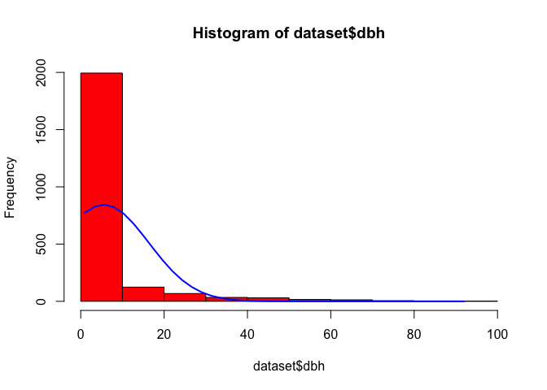
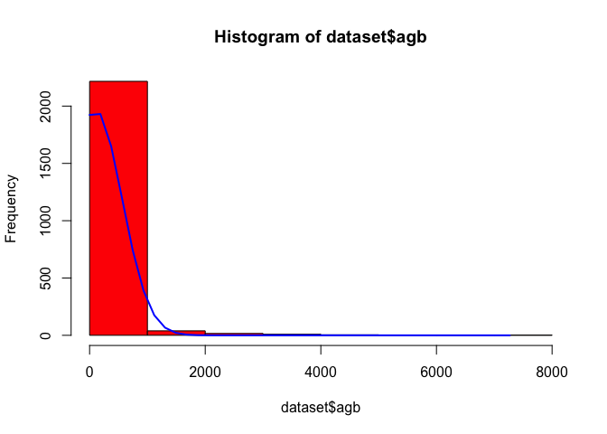
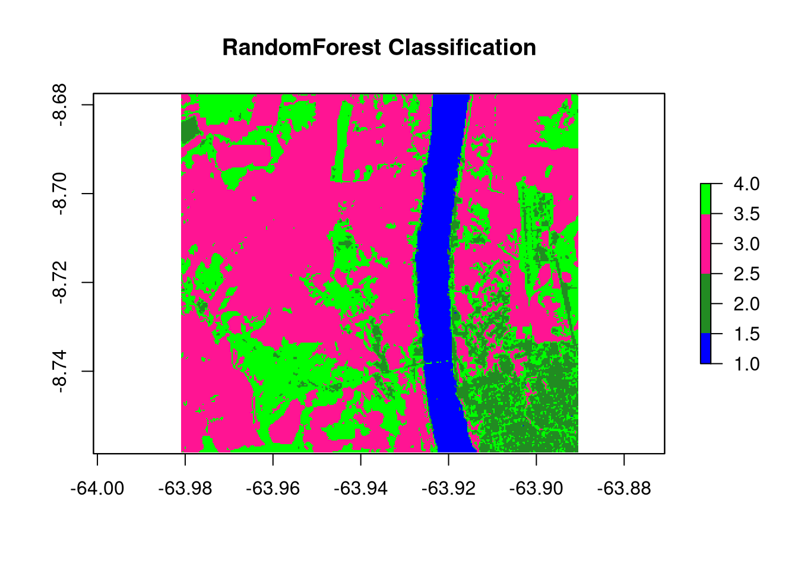
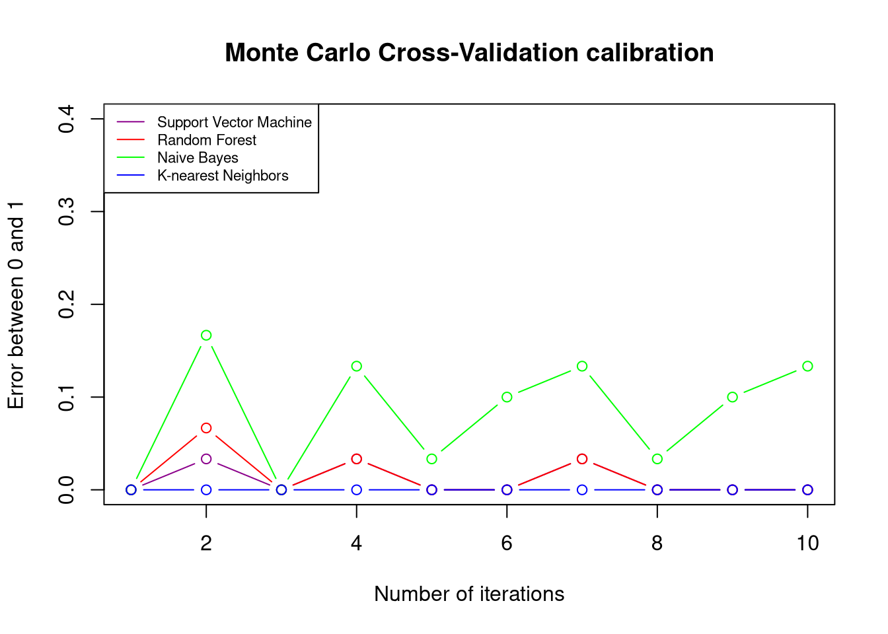

# Monte Carlo Simulation Tools for REDD+ Uncertainty Estimates

2024-12-19

-   [Introduction](#introduction)
-   [Scope of Work](#scope-of-work)
-   [Registry Requirements](#registry-requirements)
-   [Methods Review](#methods-review)
-   [Example script](#sec-1.1)
    -   [Environment setup](#environment-setup)
    -   [Monte Carlo of Emissions Factors](#monte-carlo-of-emissions-factors)
    -   [Activity Data Uncertainty](#activity-data-uncertainty)
-   [Appendix](#appendix-i)
-   [Session runtime](#runtime-snapshot)
-   [References](#references)

## Introduction {#introduction}

The ART-TREES Standard V2.01 mandates specific methodologies for calculating and reporting
uncertainty estimates associated with emission factors and activity data within jurisdictional and
nested REDD+ projects. To strengthen compliance, the ART-TREES project team produced the following
report and capacity building resources.

## Scope of Work {#scope-of-work}

This report focuses on the following technical areas:

-   Develop Monte Carlo simulation pathways to quantify uncertainty in emission factors and activity
    data, ensuring consistency with ART-TREES's emphasis on robust uncertainty analysis and
    corrective bias assessment.
-   Use R or other software to create systems that streamline data workflows and enhance
    accessibility for MRV purposes. Monte Carlo Simulation for Uncertainty Estimation
-   Document methodologies and provide results in formats compliant with ART-TREES reporting
    standards.
-   Prepare technical reports that detail uncertainty estimation methods and database management
    workflows.
-   Develop and deliver training materials to strengthen stakeholder capacity to use
    ART-TREES-aligned tools and methodologies.


##### Figure 1: Visualization of k-fold resampling ^(Note differences with Monte Carlo "LOGCV")^

## Registry Requirements {#registry-requirements}

The TREES 2.0 Standard outlines requirements for reporting uncertainty in emissions and removals,
and adjusting estimates where uncertainty levels exceed the defined threshold of a half-width of a
90% confidence interval between the upper and lower bounds. Monte Carlo simulations are identified
as an appropriate methodology due to their capacity to model variance and provide conservative
estimates from large-scale highly-variable datasets. Specifically, "Monte Carlo simulations shall
use the 90% confidence interval and a simulation n of 10,000" (p.45).

**Aggregation of Uncertainty Across Crediting Periods**\
The TREES Standard provides a level of flexibility in allowing participants to aggregate uncertainty
deductions across multiple crediting periods. At the end of each crediting period, participants may
calculate a consolidated uncertainty deduction based on the summed gross emissions reductions and
removals achieved over their entire ART participation. If prior uncertainty deductions exceeded the
aggregated deduction sum for the total period, the over-deducted credits will be issued into the
participant's registry account.

**Inclusion of Biomass Map Uncertainty**\
Uncertainty must be assessed and reported for emissions factors derived from biomass maps, as these
datasets directly impact the accuracy of emission estimates. TREES participants are encouraged to
adopt best practices, such as those outlined in the CEOS LPV Biomass Protocol 2021, to enhance
calibration, validation, and reliability of spatially explicit datasets. In this guidance document,
key recommendations for good practices include appropriate scaling, temporally & spatially
consistent reference data and remote sensing, and the use of approved error metrics (90% CI or
RMSE). In particular, three likely sources of uncertainty in biomass estimation are highlighted
separately for consideration in assessing and calibrating predictions.

-   Measurement Uncertainty in tree measurements (i.e DBH and height).
-   Allometric Model Errors in statistically inferring biomass from from tree measurements
-   Sampling & Spatial Uncertainty arising from autocorrelation & over-fitting

**Exemption for Allometric Estimates**\
An exemption from requirements for Monte Carlo simulations is granted to allometric modeled
estimates. The TREES Standards V2.0 states that "such errors are considered consistent between
emissions in the crediting level and crediting periods" which therefore do not materially influence
the net results.

**Calculating Uncertainty Deductions**\
Cited on page 46 of the TREES Standards V2.0, calculations of uncertainty deductions are derived
using the following formulae:

$$
UNC_t = (GHG ER_t + GHG REMV_t) \times UA_t
$$

|              |                                                                   |
|--------------|-------------------------------------------------------------------|
| $UNC_t$      | Uncertainty deduction for year $t$ ($tCO_2e$)                     |
| $GHG ER_t$   | Gross greenhouse gas emissions reductions for year $t$ ($tCO_2e$) |
| $GHG REMV_t$ | Gross greenhouse gas removals for year $t$ ($tCO_2e$)             |
| $UA_t$       | The uncertainty adjustment factor for year $t$                    |

##### Table 1: Parameters used in Equation 10

The uncertainty adjustment factor ($UAdj_t$) quantifies the proportional adjustment to emissions
reductions and removals based on statistical uncertainty. It is defined as:

$$
UAdj_t = 0.524417 \times \frac{HW_{90\%t}}{1.645006}
$$

|                       |                                                                 |
|-----------------------|-----------------------------------------------------------------|
| $90\%\text{ C I}_{t}$ | The half-width of 90% confidence interval as percentage of mean |
| $1.645006$            | $t$ value for a 90% confidence interval                         |
| $0.524417$            | A scaling constant to adjust the proportion.                    |

##### Table 2: Parameters used in Equation 11

## Example script

#### Environment setup {#environment-setup}

``` r
easypackages::packages(
  "animation", "BIOMASS", "caret", "dataMaid", "DescTools", "dplyr",
  "extrafont", "FawR", "ForestToolsRS", "ggplot2", "htmltools",
  "janitor", "jsonlite", "lattice", "kableExtra", "kernlab",
  "knitr", "Mlmetrics", "olsrr", "plotly", "psych", "RColorBrewer",
  "rmarkdown", "readxl", "solarizeddox", "tibble", "tidymodels", "tidyverse",
  "tinytex", "tune", "useful", "webshot", "webshot2",
  prompt = F
  )
```

### Monte Carlo of Emissions Factors {#monte-carlo-of-emissions-factors}

#### Import data {#import-data}

This section outlines the tools for importing and preparing forestry and biomass data for analysis,
a key step in building ART-TREES-compliant MRV systems. Using the `allodb` package, we load a global
allometry database and a dummy dataset from the Smithsonian Institute ForestGEO project.

``` r
library("allodb") # https://docs.ropensci.org/allodb/
set.seed(333)
#data(ufc) # spuRs::vol.m3(dataset$dbh.cm, dataset$height.m, multiplier = 0.5)
data(scbi_stem1)
dataset = scbi_stem1
head(dataset) |> tibble::as_tibble()
```

```         
# A tibble: 6 × 6
  treeID stemID   dbh genus species Family     
   <int>  <int> <dbl> <chr> <chr>   <chr>      
1   2695   2695  1.41 Acer  negundo Sapindaceae
2   1229  38557  1.67 Acer  negundo Sapindaceae
3   1230   1230  1.42 Acer  negundo Sapindaceae
4   1295  32303  1.04 Acer  negundo Sapindaceae
5   1229  32273  2.47 Acer  negundo Sapindaceae
6     66  31258  2.19 Acer  negundo Sapindaceae
```

``` r
psych::describe(dataset)
```

```         
         vars    n     mean       sd  median  trimmed     mad min      max
treeID      1 2287  2778.66  1929.26 2525.00  2705.54 2091.95   1  6207.00
stemID      2 2287 16577.12 16197.88 5022.00 15661.27 5749.52   1 40180.00
dbh         3 2287     5.52    10.80    1.67     2.65    0.79   1    92.02
genus*      4 2287    16.37     6.52   18.00    16.71    0.00   1    31.00
species*    5 2287    13.26     9.60    8.00    11.31    0.00   1    40.00
Family*     6 2287    13.07     4.02   13.00    13.33    0.00   1    22.00
            range  skew kurtosis     se
treeID    6206.00  0.27    -1.11  40.34
stemID   40179.00  0.40    -1.75 338.71
dbh         91.02  3.81    16.30   0.23
genus*      30.00 -0.57     0.14   0.14
species*    39.00  1.59     1.30   0.20
Family*     21.00 -0.58     1.44   0.08
```

``` r
str(dataset)
```

```         
tibble [2,287 × 6] (S3: tbl_df/tbl/data.frame)
 $ treeID : int [1:2287] 2695 1229 1230 1295 1229 66 2600 4936 1229 1005 ...
 $ stemID : int [1:2287] 2695 38557 1230 32303 32273 31258 2600 4936 36996 1005 ...
 $ dbh    : num [1:2287] 1.41 1.67 1.42 1.04 2.47 ...
 $ genus  : chr [1:2287] "Acer" "Acer" "Acer" "Acer" ...
 $ species: chr [1:2287] "negundo" "negundo" "negundo" "negundo" ...
 $ Family : chr [1:2287] "Sapindaceae" "Sapindaceae" "Sapindaceae" "Sapindaceae" ...
```

##### Table 3: Smithsonian Institute GEOForest dataset from `allodb` package (n = 2287)

#### Probability density functions {#probability-density-functions}

Accurate selection of probability density functions (PDFs) is essential for modeling uncertainties
in carbon stocks and activity data. This section describes methodologies for fitting PDFs to data,
ensuring results are robust and aligned with ART-TREES best practices.

-   Use of statistical tests for goodness-of-fit validation.

-   Integration of domain expertise to refine parameter selection.

``` r
# add allometry database
data(equations)
data("equations_metadata")
show_cols   = c("equation_id", "equation_taxa", "equation_allometry")
eq_tab_acer = new_equations(subset_taxa = "Acer")
head(eq_tab_acer[, show_cols])
```

```         
# A tibble: 6 × 3
  equation_id equation_taxa       equation_allometry                            
  <chr>       <chr>               <chr>                                         
1 a4e4d1      Acer saccharum      exp(-2.192-0.011*dbh+2.67*(log(dbh)))         
2 dfc2c7      Acer rubrum         2.02338*(dbh^2)^1.27612                       
3 eac63e      Acer rubrum         5.2879*(dbh^2)^1.07581                        
4 f49bcb      Acer pseudoplatanus exp(-5.644074+(2.5189*(log(pi*dbh))))         
5 14bf3d      Acer mandshuricum   0.0335*(dbh)^1.606+0.0026*(dbh)^3.323+0.1222*…
6 0c7cd6      Acer mono           0.0202*(dbh)^1.810+0.0111*(dbh)^2.740+0.1156*…
```

``` r
# Compute above ground biomass
dataset$agb = allodb::get_biomass(
    dbh     = dataset$dbh,
    genus   = dataset$genus,
    species = dataset$species,
    coords  = c(-78.2, 38.9)
  )

# examine dbh ~ agb function
dbh_agb = lm(dbh ~ agb, data = dataset)
#olsrr::ols_test_breusch_pagan(lm(dbh_agb)) #<0.0000
#h = lattice::histogram(dbh ~ agb, data = dataset)
plot(
  x    = dataset$dbh,
  y    = dataset$agb,
  col  = factor(scbi_stem1$genus),
  xlab = "DBH (cm)",
  ylab = "AGB (kg)"
)

# examine univariate distributions
h1 = hist(dataset$dbh, breaks=10, col="red")
xfit<-seq(min(dataset$dbh),max(dataset$dbh),length=40)
yfit<-dnorm(xfit,mean=mean(dataset$dbh),sd=sd(dataset$dbh))
yfit <- yfit*diff(h1$mids[1:2])*length(dataset$dbh)
lines(xfit, yfit, col="blue", lwd=2)

h2 = hist(dataset$agb, breaks=10, col="red")
xfit<-seq(min(dataset$agb),max(dataset$agb),length=40)
yfit<-dnorm(xfit,mean=mean(dataset$agb),sd=sd(dataset$agb))
yfit <- yfit*diff(h2$mids[1:2])*length(dataset$agb)
lines(xfit, yfit, col="blue", lwd=2)
wilcox.test(dataset$dbh) # p<0.00001
```

```         
    Wilcoxon signed rank test with continuity correction

data:  dataset$dbh
V = 2616328, p-value < 2.2e-16
alternative hypothesis: true location is not equal to 0
```

``` r
wilcox.test(dataset$agb) # p<0.00001
```

```         
    Wilcoxon signed rank test with continuity correction

data:  dataset$agb
V = 2616328, p-value < 2.2e-16
alternative hypothesis: true location is not equal to 0
```



#### Simulation Design {#simulation-design}

This section introduces the design of the Monte Carlo simulation regime, including:

-   Simulation parameters are defined to balance computational efficiency and statistical
    robustness.

-   Cross-validation techniques are employed to evaluate model performance and identify bias or
    variance.

The `LGOCV` acronym used in the `caret` package functions below stands for "leave one group out
cross validation". We must select the % of test data that is set out from the build upon which the
model will be repeatedly trained. Note, the following code applies functions to full dataset without
explicit training-test split. **Questions remains on whether we require cross-validation uncertainty
estimate to review internal bias, and whether we would like to develop Monte Carlo tools for spatial
uncertainty used in Activity Data analysis**. For your consideration, the consultant has previously
developed Monte Carlo tools for LULC applications, saved
[here](https://github.com/seamusrobertmurphy/02-lulc-classification)

``` r
# Cross-validation split for bias detection
#samples     = caret::createDataPartition(dataset_tidy$volume, p = 0.80, list = FALSE)
#train_data  = dataset_tidy[samples, ]
#test_data   = dataset_tidy[-samples, ]

# Simulation pattern & regime
monte_carlo = trainControl(
  method    = "LGOCV",
  number    = 10,     # number of simulations
  p         = 0.8)     # percentage resampled


# Training model fit with all covariates (".") & the simulation
lm_monte_carlo = train(
  data      = dataset, 
  agb ~ ., 
  na.action = na.omit,
  trControl = monte_carlo)

lm_monte_carlo 
```

```         
Random Forest 

2287 samples
   6 predictor

No pre-processing
Resampling: Repeated Train/Test Splits Estimated (10 reps, 80%) 
Summary of sample sizes: 1832, 1832, 1832, 1832, 1832, 1832, ... 
Resampling results across tuning parameters:

  mtry  RMSE       Rsquared   MAE       
   2    334.19769  0.6035154  114.313008
  47     82.31374  0.9715600   13.758606
  93     49.07356  0.9898362    8.510285

RMSE was used to select the optimal model using the smallest value.
The final value used for the model was mtry = 93.
```

#### Visualize residuals {#visualize-residuals}

To enable access to these predictions, we need to instruct `caret` to retain the resampled
predictions by setting `savePredictions = "final"` in our `trainControl()` function. It's important
to be aware that if you're working with a large dataset or numerous resampling iterations, the
resulting `train()` object may grow significantly in size. This happens because `caret` must store a
record of every row, including both the observed values and predictions, for each resampling
iteration. By visualizing the results, we can offer insights into the performance of our model on
the resampled data.

``` r
monte_carlo_viz = trainControl(
  method    = "LGOCV", 
  p         = 0.8,            
  number    = 1,  # just for saving previous results
  savePredictions = "final") 

lm_monte_carlo_viz = train(
  agb ~ ., 
  data      = dataset, 
  method    = "lm",
  na.action = na.omit,
  trControl = monte_carlo_viz)

head(lm_monte_carlo_viz$pred)  # residuals 
```

```         
  intercept       pred          obs rowIndex  Resample
1      TRUE -109.35929   0.18320423        1 Resample1
2      TRUE  -63.59706   0.56378062        6 Resample1
3      TRUE -130.47898   0.18320423       10 Resample1
4      TRUE -144.19036   0.09947204       12 Resample1
5      TRUE -142.33348   0.09496032       15 Resample1
6      TRUE 1222.08038 789.41947426       18 Resample1
```

``` r
lm_monte_carlo_viz$pred |> 
  ggplot(aes(x=pred,y=obs)) +
    geom_point(shape=1) + 
    geom_abline(slope=1, colour='blue')  +
    coord_obs_pred()
```

<!-- -->

### Activity Data Uncertainty {#activity-data-uncertainty}

This section showcases use of Monte Carlo simulations in reporting uncertainty of LULC
classification models.

``` r
library(ForesToolboxRS)
dir.create("./data/testdata")
download.file("https://github.com/ytarazona/ft_data/raw/main/data/LC08_232066_20190727_SR.zip",destfile = "testdata/LC08_232066_20190727_SR.zip")
unzip("testdata/LC08_232066_20190727_SR.zip", exdir = "testdata") download.file("https://github.com/ytarazona/ft_data/raw/main/data/signatures.zip", destfile = "testdata/signatures.zip")
unzip("testdata/signatures.zip", exdir = "testdata")

image <- stack("./data/testdata/LC08_232066_20190727_SR.tif")
sig <- read_sf("./data/testdata/signatures.shp")
classRF <- mla(img = image, model = "randomForest", endm = sig, training_split = 80)
print(classRF)
```

``` r
# Classification
colmap <- c("#0000FF","#228B22","#FF1493", "#00FF00")
plot(classRF$Classification, main = "RandomForest Classification", col = colmap, axes = TRUE)
```

 \##### Figure 2: LULC map
classified with randomForest classifier kernel

``` r
plot(
  cal_ml$svm_mccv,
  main = "Monte Carlo Cross-Validation calibration",
  col = "darkmagenta",
  type = "b",
  ylim = c(0, 0.4),
  ylab = "Error between 0 and 1",
  xlab = "Number of iterations"
)
lines(cal_ml$randomForest_mccv, col = "red", type = "b")
lines(cal_ml$naiveBayes_mccv, col = "green", type = "b")
lines(cal_ml$knn_mccv, col = "blue", type = "b")
legend(
  "topleft",
  c(
    "Support Vector Machine",
    "Random Forest",
    "Naive Bayes",
    "K-nearest Neighbors"
  ),
  col = c("darkmagenta", "red", "green", "blue"),
  lty = 1,
  cex = 0.7
)
```



----------------------------------------------------------------------------------------------------

## Session runtime {#runtime-snapshot}

``` r
devtools::session_info()
```

```         
─ Session info ───────────────────────────────────────────────────────────────
 setting  value
 version  R version 4.4.2 (2024-10-31)
 os       macOS Sequoia 15.2
 system   aarch64, darwin20
 ui       X11
 language (EN)
 collate  en_US.UTF-8
 ctype    en_US.UTF-8
 tz       America/Vancouver
 date     2024-12-24
 pandoc   3.2 @ /Applications/RStudio.app/Contents/Resources/app/quarto/bin/tools/aarch64/ (via rmarkdown)

─ Packages ───────────────────────────────────────────────────────────────────
 package      * version    date (UTC) lib source
 abind          1.4-8      2024-09-12 [1] CRAN (R 4.4.1)
 allodb       * 0.0.1.9000 2024-12-19 [1] Github (ropensci/allodb@4207f86)
 animation    * 2.7        2021-10-07 [1] CRAN (R 4.4.0)
 assertthat     0.2.1      2019-03-21 [1] CRAN (R 4.4.0)
 backports      1.5.0      2024-05-23 [1] CRAN (R 4.4.0)
 BIOMASS      * 2.1.11     2023-09-29 [1] CRAN (R 4.4.0)
 boot           1.3-31     2024-08-28 [1] CRAN (R 4.4.2)
 broom        * 1.0.7      2024-09-26 [1] CRAN (R 4.4.1)
 c2z          * 0.2.0      2023-08-10 [1] CRAN (R 4.4.0)
 cachem         1.1.0      2024-05-16 [1] CRAN (R 4.4.0)
 car            3.1-3      2024-09-27 [1] CRAN (R 4.4.1)
 carData        3.0-5      2022-01-06 [1] CRAN (R 4.4.0)
 caret        * 7.0-1      2024-12-10 [1] CRAN (R 4.4.1)
 cellranger     1.1.0      2016-07-27 [1] CRAN (R 4.4.0)
 chromote       0.3.1      2024-08-30 [1] CRAN (R 4.4.1)
 class          7.3-22     2023-05-03 [1] CRAN (R 4.4.2)
 classInt       0.4-10     2023-09-05 [1] CRAN (R 4.4.0)
 cli            3.6.3      2024-06-21 [1] CRAN (R 4.4.0)
 codetools      0.2-20     2024-03-31 [1] CRAN (R 4.4.2)
 colorspace     2.1-1      2024-07-26 [1] CRAN (R 4.4.0)
 data.table     1.16.4     2024-12-06 [1] CRAN (R 4.4.1)
 dataMaid     * 1.4.1      2021-10-08 [1] CRAN (R 4.4.0)
 DBI            1.2.3      2024-06-02 [1] CRAN (R 4.4.0)
 DEoptimR       1.1-3-1    2024-11-23 [1] CRAN (R 4.4.1)
 DescTools    * 0.99.58    2024-11-08 [1] CRAN (R 4.4.1)
 devtools       2.4.5      2022-10-11 [1] CRAN (R 4.4.0)
 dials        * 1.3.0.9000 2024-12-19 [1] Github (tidymodels/dials@7c2e0bb)
 DiceDesign     1.10       2023-12-07 [1] CRAN (R 4.4.0)
 digest         0.6.37     2024-08-19 [1] CRAN (R 4.4.1)
 dplyr        * 1.1.4      2023-11-17 [1] CRAN (R 4.4.0)
 e1071          1.7-16     2024-09-16 [1] CRAN (R 4.4.1)
 easypackages   0.1.0      2016-12-05 [1] CRAN (R 4.4.0)
 ellipsis       0.3.2      2021-04-29 [1] CRAN (R 4.4.0)
 evaluate       1.0.1      2024-10-10 [1] CRAN (R 4.4.1)
 Exact          3.3        2024-07-21 [1] CRAN (R 4.4.0)
 expm           1.0-0      2024-08-19 [1] CRAN (R 4.4.1)
 extrafont    * 0.19       2023-01-18 [1] CRAN (R 4.4.0)
 extrafontdb    1.0        2012-06-11 [1] CRAN (R 4.4.0)
 farver         2.1.2      2024-05-13 [1] CRAN (R 4.4.0)
 fastmap        1.2.0      2024-05-15 [1] CRAN (R 4.4.0)
 forcats      * 1.0.0      2023-01-29 [1] CRAN (R 4.4.0)
 foreach        1.5.2      2022-02-02 [1] CRAN (R 4.4.0)
 Formula        1.2-5      2023-02-24 [1] CRAN (R 4.4.0)
 fs             1.6.5      2024-10-30 [1] CRAN (R 4.4.1)
 furrr          0.3.1      2022-08-15 [1] CRAN (R 4.4.0)
 future         1.34.0     2024-07-29 [1] CRAN (R 4.4.0)
 future.apply   1.11.3     2024-10-27 [1] CRAN (R 4.4.1)
 generics       0.1.3      2022-07-05 [1] CRAN (R 4.4.0)
 ggplot2      * 3.5.1      2024-04-23 [1] CRAN (R 4.4.0)
 gld            2.6.6      2022-10-23 [1] CRAN (R 4.4.0)
 globals        0.16.3     2024-03-08 [1] CRAN (R 4.4.0)
 glue           1.8.0      2024-09-30 [1] CRAN (R 4.4.1)
 goftest        1.2-3      2021-10-07 [1] CRAN (R 4.4.0)
 gower          1.0.2      2024-12-17 [1] CRAN (R 4.4.1)
 GPfit          1.0-8      2019-02-08 [1] CRAN (R 4.4.0)
 gridExtra      2.3        2017-09-09 [1] CRAN (R 4.4.0)
 gtable         0.3.6      2024-10-25 [1] CRAN (R 4.4.1)
 hardhat        1.4.0.9002 2024-12-19 [1] Github (tidymodels/hardhat@b1fe750)
 haven          2.5.4      2023-11-30 [1] CRAN (R 4.4.0)
 hms            1.1.3      2023-03-21 [1] CRAN (R 4.4.0)
 htmltools    * 0.5.8.1    2024-04-04 [1] CRAN (R 4.4.0)
 htmlwidgets    1.6.4      2023-12-06 [1] CRAN (R 4.4.0)
 httpuv         1.6.15     2024-03-26 [1] CRAN (R 4.4.0)
 httr           1.4.7      2023-08-15 [1] CRAN (R 4.4.0)
 infer        * 1.0.7      2024-03-25 [1] CRAN (R 4.4.0)
 ipred          0.9-15     2024-07-18 [1] CRAN (R 4.4.0)
 iterators      1.0.14     2022-02-05 [1] CRAN (R 4.4.0)
 janitor      * 2.2.0      2023-02-02 [1] CRAN (R 4.4.0)
 jsonlite     * 1.8.9      2024-09-20 [1] CRAN (R 4.4.1)
 kableExtra   * 1.4.0      2024-01-24 [1] CRAN (R 4.4.0)
 kernlab      * 0.9-33     2024-08-13 [1] CRAN (R 4.4.0)
 KernSmooth     2.23-24    2024-05-17 [1] CRAN (R 4.4.2)
 knitr        * 1.49       2024-11-08 [1] CRAN (R 4.4.1)
 labeling       0.4.3      2023-08-29 [1] CRAN (R 4.4.0)
 later          1.4.1      2024-11-27 [1] CRAN (R 4.4.1)
 lattice      * 0.22-6     2024-03-20 [1] CRAN (R 4.4.0)
 lava           1.8.0      2024-03-05 [1] CRAN (R 4.4.0)
 lazyeval       0.2.2      2019-03-15 [1] CRAN (R 4.4.0)
 lhs            1.2.0      2024-06-30 [1] CRAN (R 4.4.0)
 lifecycle      1.0.4      2023-11-07 [1] CRAN (R 4.4.0)
 listenv        0.9.1      2024-01-29 [1] CRAN (R 4.4.0)
 lmom           3.2        2024-09-30 [1] CRAN (R 4.4.1)
 lubridate    * 1.9.4      2024-12-08 [1] CRAN (R 4.4.1)
 magrittr       2.0.3      2022-03-30 [1] CRAN (R 4.4.0)
 MASS           7.3-61     2024-06-13 [1] CRAN (R 4.4.2)
 Matrix         1.7-1      2024-10-18 [1] CRAN (R 4.4.2)
 memoise        2.0.1      2021-11-26 [1] CRAN (R 4.4.0)
 mime           0.12       2021-09-28 [1] CRAN (R 4.4.0)
 miniUI         0.1.1.1    2018-05-18 [1] CRAN (R 4.4.0)
 minpack.lm     1.2-4      2023-09-11 [1] CRAN (R 4.4.0)
 mnormt         2.1.1      2022-09-26 [1] CRAN (R 4.4.0)
 modeldata    * 1.4.0      2024-06-19 [1] CRAN (R 4.4.0)
 ModelMetrics   1.2.2.2    2020-03-17 [1] CRAN (R 4.4.0)
 munsell        0.5.1      2024-04-01 [1] CRAN (R 4.4.0)
 mvtnorm        1.3-2      2024-11-04 [1] CRAN (R 4.4.1)
 nlme           3.1-166    2024-08-14 [1] CRAN (R 4.4.2)
 nnet           7.3-19     2023-05-03 [1] CRAN (R 4.4.2)
 nortest        1.0-4      2015-07-30 [1] CRAN (R 4.4.0)
 olsrr        * 0.6.1      2024-11-06 [1] CRAN (R 4.4.1)
 pander         0.6.5      2022-03-18 [1] CRAN (R 4.4.0)
 parallelly     1.41.0     2024-12-18 [1] CRAN (R 4.4.1)
 parsnip      * 1.2.1.9004 2024-12-19 [1] Github (tidymodels/parsnip@27df158)
 pillar         1.10.0     2024-12-17 [1] CRAN (R 4.4.1)
 pkgbuild       1.4.5      2024-10-28 [1] CRAN (R 4.4.1)
 pkgconfig      2.0.3      2019-09-22 [1] CRAN (R 4.4.0)
 pkgload        1.4.0      2024-06-28 [1] CRAN (R 4.4.0)
 plotly       * 4.10.4     2024-01-13 [1] CRAN (R 4.4.0)
 plyr           1.8.9      2023-10-02 [1] CRAN (R 4.4.0)
 pROC           1.18.5     2023-11-01 [1] CRAN (R 4.4.0)
 processx       3.8.4      2024-03-16 [1] CRAN (R 4.4.0)
 prodlim        2024.06.25 2024-06-24 [1] CRAN (R 4.4.0)
 profvis        0.4.0      2024-09-20 [1] CRAN (R 4.4.1)
 promises       1.3.2      2024-11-28 [1] CRAN (R 4.4.1)
 proxy          0.4-27     2022-06-09 [1] CRAN (R 4.4.0)
 ps             1.8.1      2024-10-28 [1] CRAN (R 4.4.1)
 psych        * 2.4.6.26   2024-06-27 [1] CRAN (R 4.4.0)
 purrr        * 1.0.2      2023-08-10 [1] CRAN (R 4.4.0)
 R6             2.5.1      2021-08-19 [1] CRAN (R 4.4.0)
 randomForest   4.7-1.2    2024-09-22 [1] CRAN (R 4.4.1)
 rappdirs       0.3.3      2021-01-31 [1] CRAN (R 4.4.0)
 RColorBrewer * 1.1-3      2022-04-03 [1] CRAN (R 4.4.0)
 Rcpp           1.0.13-1   2024-11-02 [1] CRAN (R 4.4.1)
 readr        * 2.1.5      2024-01-10 [1] CRAN (R 4.4.0)
 readxl       * 1.4.3      2023-07-06 [1] CRAN (R 4.4.0)
 recipes      * 1.1.0.9001 2024-12-19 [1] Github (tidymodels/recipes@e738967)
 remotes        2.5.0      2024-03-17 [1] CRAN (R 4.4.0)
 reshape2       1.4.4      2020-04-09 [1] CRAN (R 4.4.0)
 rlang          1.1.4      2024-06-04 [1] CRAN (R 4.4.0)
 rmarkdown    * 2.29       2024-11-04 [1] CRAN (R 4.4.1)
 robustbase     0.99-4-1   2024-09-27 [1] CRAN (R 4.4.1)
 rootSolve      1.8.2.4    2023-09-21 [1] CRAN (R 4.4.0)
 rpart          4.1.23     2023-12-05 [1] CRAN (R 4.4.2)
 rsample      * 1.2.1.9000 2024-12-19 [1] Github (tidymodels/rsample@f799dba)
 rstudioapi     0.17.1     2024-10-22 [1] CRAN (R 4.4.1)
 Rttf2pt1       1.3.12     2023-01-22 [1] CRAN (R 4.4.0)
 rvest          1.0.4      2024-02-12 [1] CRAN (R 4.4.0)
 scales       * 1.3.0      2023-11-28 [1] CRAN (R 4.4.0)
 sessioninfo    1.2.2      2021-12-06 [1] CRAN (R 4.4.0)
 sf             1.0-19     2024-11-05 [1] CRAN (R 4.4.1)
 shiny          1.10.0     2024-12-14 [1] CRAN (R 4.4.1)
 snakecase      0.11.1     2023-08-27 [1] CRAN (R 4.4.0)
 stringi        1.8.4      2024-05-06 [1] CRAN (R 4.4.0)
 stringr      * 1.5.1      2023-11-14 [1] CRAN (R 4.4.0)
 survival       3.7-0      2024-06-05 [1] CRAN (R 4.4.2)
 svglite        2.1.3      2023-12-08 [1] CRAN (R 4.4.0)
 systemfonts    1.1.0      2024-05-15 [1] CRAN (R 4.4.0)
 terra          1.8-5      2024-12-12 [1] CRAN (R 4.4.1)
 tibble       * 3.2.1      2023-03-20 [1] CRAN (R 4.4.0)
 tidymodels   * 1.2.0      2024-03-25 [1] CRAN (R 4.4.0)
 tidyr        * 1.3.1      2024-01-24 [1] CRAN (R 4.4.0)
 tidyselect     1.2.1      2024-03-11 [1] CRAN (R 4.4.0)
 tidyverse    * 2.0.0      2023-02-22 [1] CRAN (R 4.4.0)
 timechange     0.3.0      2024-01-18 [1] CRAN (R 4.4.0)
 timeDate       4041.110   2024-09-22 [1] CRAN (R 4.4.1)
 tinytex      * 0.54       2024-11-01 [1] CRAN (R 4.4.1)
 tune         * 1.2.1.9000 2024-12-19 [1] Github (tidymodels/tune@d62199a)
 tzdb           0.4.0      2023-05-12 [1] CRAN (R 4.4.0)
 units          0.8-5      2023-11-28 [1] CRAN (R 4.4.0)
 urlchecker     1.0.1      2021-11-30 [1] CRAN (R 4.4.0)
 useful       * 1.2.6.1    2023-10-24 [1] CRAN (R 4.4.0)
 usethis        3.1.0      2024-11-26 [1] CRAN (R 4.4.1)
 utf8           1.2.4      2023-10-22 [1] CRAN (R 4.4.0)
 vctrs          0.6.5      2023-12-01 [1] CRAN (R 4.4.0)
 viridisLite    0.4.2      2023-05-02 [1] CRAN (R 4.4.0)
 webshot      * 0.5.5      2023-06-26 [1] CRAN (R 4.4.0)
 webshot2     * 0.1.1      2023-08-11 [1] CRAN (R 4.4.0)
 websocket      1.4.2      2024-07-22 [1] CRAN (R 4.4.0)
 withr          3.0.2      2024-10-28 [1] CRAN (R 4.4.1)
 workflows    * 1.1.4.9000 2024-12-19 [1] Github (tidymodels/workflows@784d0fd)
 workflowsets * 1.1.0      2024-03-21 [1] CRAN (R 4.4.0)
 xfun           0.49       2024-10-31 [1] CRAN (R 4.4.1)
 xml2           1.3.6      2023-12-04 [1] CRAN (R 4.4.0)
 xtable         1.8-4      2019-04-21 [1] CRAN (R 4.4.0)
 yaml           2.3.10     2024-07-26 [1] CRAN (R 4.4.0)
 yardstick    * 1.3.1      2024-03-21 [1] CRAN (R 4.4.0)

 [1] /Library/Frameworks/R.framework/Versions/4.4-arm64/Resources/library

──────────────────────────────────────────────────────────────────────────────
```

``` r
Sys.getenv()
```

```         
__CF_USER_TEXT_ENCODING
                        0x1F5:0x0:0x52
__CFBundleIdentifier    com.rstudio.desktop
CLICOLOR_FORCE          1
COMMAND_MODE            unix2003
DISPLAY                 /private/tmp/com.apple.launchd.4rgyzU7ML7/org.xquartz:0
DYLD_FALLBACK_LIBRARY_PATH
                        /Library/Frameworks/R.framework/Resources/lib:/Library/Java/JavaVirtualMachines/jdk-11.0.18+10/Contents/Home/lib/server
EDITOR                  vi
GDAL_DATA               /Library/Frameworks/R.framework/Versions/4.4-arm64/Resources/library/sf/gdal
GIT_ASKPASS             rpostback-askpass
HOME                    /Users/seamus
LANG                    en_US.UTF-8
LC_CTYPE                en_US.UTF-8
LN_S                    ln -s
LOGNAME                 seamus
MAKE                    make
MallocNanoZone          0
MPLENGINE               tkAgg
NOT_CRAN                true
ORIGINAL_XDG_CURRENT_DESKTOP
                        undefined
PAGER                   /usr/bin/less
PATH                    /opt/local/bin:/opt/local/sbin:/usr/local/bin:/System/Cryptexes/App/usr/bin:/usr/bin:/bin:/usr/sbin:/sbin:/var/run/com.apple.security.cryptexd/codex.system/bootstrap/usr/local/bin:/var/run/com.apple.security.cryptexd/codex.system/bootstrap/usr/bin:/var/run/com.apple.security.cryptexd/codex.system/bootstrap/usr/appleinternal/bin:/opt/X11/bin:/Library/Apple/usr/bin:/Library/TeX/texbin:/Applications/quarto/bin:/usr/texbin:/Applications/RStudio.app/Contents/Resources/app/bin/postback
PKGLOAD_PARENT_TEMPDIR
                        /var/folders/_t/0yt99n3d0s1c1hnx40n3g9gw0000gn/T//RtmpEl1E7q
PWD                     /Users/seamus/repos/monte-carlo-trees
PYTHONIOENCODING        utf-8
R_ARCH                  
R_BROWSER               /usr/bin/open
R_BZIPCMD               /usr/bin/bzip2
R_CLI_HAS_HYPERLINK_IDE_HELP
                        true
R_CLI_HAS_HYPERLINK_IDE_RUN
                        true
R_CLI_HAS_HYPERLINK_IDE_VIGNETTE
                        true
R_DOC_DIR               /Library/Frameworks/R.framework/Resources/doc
R_GZIPCMD               /usr/bin/gzip
R_HOME                  /Library/Frameworks/R.framework/Resources
R_INCLUDE_DIR           /Library/Frameworks/R.framework/Resources/include
R_LIBS                  /Library/Frameworks/R.framework/Versions/4.4-arm64/Resources/library
R_LIBS_SITE             /Library/Frameworks/R.framework/Resources/site-library
R_LIBS_USER             /Users/seamus/Library/R/arm64/4.4/library
R_PAPERSIZE             a4
R_PAPERSIZE_USER        a4
R_PDFVIEWER             /usr/bin/open
R_PLATFORM              aarch64-apple-darwin20
R_PRINTCMD              lpr
R_QPDF                  /Library/Frameworks/R.framework/Resources/bin/qpdf
R_RD4PDF                times,inconsolata,hyper
R_RUNTIME               
R_SESSION_TMPDIR        /var/folders/_t/0yt99n3d0s1c1hnx40n3g9gw0000gn/T//RtmpEl1E7q
R_SHARE_DIR             /Library/Frameworks/R.framework/Resources/share
R_STRIP_SHARED_LIB      strip -x
R_STRIP_STATIC_LIB      strip -S
R_TEXI2DVICMD           /opt/R/arm64/bin/texi2dvi
R_UNZIPCMD              /usr/bin/unzip
R_ZIPCMD                /usr/bin/zip
RMARKDOWN_MATHJAX_PATH
                        /Applications/RStudio.app/Contents/Resources/app/resources/mathjax-27
RMARKDOWN_PREVIEW_DIR   /var/folders/_t/0yt99n3d0s1c1hnx40n3g9gw0000gn/T//RtmpnIFRFp
RS_LOG_LEVEL            WARN
RS_RPOSTBACK_PATH       /Applications/RStudio.app/Contents/Resources/app/bin/rpostback
RS_SHARED_SECRET        bf153341-8ba4-4d2e-8d0b-a0255dbd97fb
RSTUDIO                 1
RSTUDIO_CHILD_PROCESS_PANE
                        render
RSTUDIO_CLI_HYPERLINKS
                        true
RSTUDIO_CONSOLE_COLOR   256
RSTUDIO_CONSOLE_WIDTH   135
RSTUDIO_DESKTOP_EXE     /Applications/RStudio.app/Contents/MacOS/RStudio
RSTUDIO_FALLBACK_LIBRARY_PATH
                        /var/folders/_t/0yt99n3d0s1c1hnx40n3g9gw0000gn/T/rstudio-fallback-library-path-1465870592
RSTUDIO_LONG_VERSION    2024.12.0+467
RSTUDIO_PANDOC          /Applications/RStudio.app/Contents/Resources/app/quarto/bin/tools/aarch64
RSTUDIO_PROGRAM_MODE    desktop
RSTUDIO_SESSION_PID     4149
RSTUDIO_SESSION_PORT    43653
RSTUDIO_USER_IDENTITY   seamus
RSTUDIO_VERSION         2024.12.0.467
RSTUDIOAPI_IPC_REQUESTS_FILE
                        /var/folders/_t/0yt99n3d0s1c1hnx40n3g9gw0000gn/T/RtmpnIFRFp/rstudio-ipc-requests-103529497343.rds
RSTUDIOAPI_IPC_RESPONSE_FILE
                        /var/folders/_t/0yt99n3d0s1c1hnx40n3g9gw0000gn/T/RtmpnIFRFp/rstudio-ipc-response-1035152e48e2.rds
RSTUDIOAPI_IPC_SHARED_SECRET
                        9a21b463-e5d2-47ef-bb86-7d7745dc7918
SED                     /usr/bin/sed
SHELL                   /bin/zsh
SHLVL                   0
SSH_ASKPASS             rpostback-askpass
SSH_AUTH_SOCK           /private/tmp/com.apple.launchd.E3qNaBOYzP/Listeners
TAR                     /usr/bin/tar
TERM                    xterm-256color
TMPDIR                  /var/folders/_t/0yt99n3d0s1c1hnx40n3g9gw0000gn/T/
TZDIR                   /usr/share/zoneinfo
USER                    seamus
XPC_FLAGS               0x0
XPC_SERVICE_NAME        application.com.rstudio.desktop.1074390.1074413
```

``` r
.libPaths()
```

```         
[1] "/Library/Frameworks/R.framework/Versions/4.4-arm64/Resources/library"
```

## Appendix I {#appendix-i}

Literature review of current Monte Carlo methods used in REDD+ and ART-TREES projects

| **Parameter** | **Description** |
|----|----|
| **Keywords** | Monte Carlo simulations |
|  | Biomass estimation |
|  | Carbon stock uncertainty |
|  | REDD+ projects |
|  | Forest carbon accounting |
|  | Allometric uncertainty |
| **Data Sources** | Scopus |
|  | Web of Science |
|  | Google Scholar |
|  | Grey Literature from REDD+ working groups (i.e. UNFCCC, IPCC) |
| **Temporal Window** | 2003--2023 |
| **Focus Areas** | Applications of Monte Carlo simulations in biomass and carbon stock estimations. |
|  | Addressing uncertainty in input data (e.g., allometric equations, plot-level measurements). |
|  | Integration of Monte Carlo methods in REDD+ policy frameworks and carbon accounting. |
| **Inclusion Criteria** | Peer-reviewed articles and high-impact reviews |
|  | Case studies and empirical research involving REDD+ projects. |
|  | Discussions of methodological advancements or critiques of Monte Carlo approaches. |

##### Table 4: Search parameters used in a review of Monte Carlo tools in REDD+

reporting.

| **REDD+ scheme**[^readme-1] | **Monte Carlo applied** | **Region** | **Key Findings** | **Ref** |
|----|----|----|----|:--:|
| ADD | Uncertainty of SAAB estimate | Rondônia, Brazil | Estimated ± 20% measurement error in SAAB using Monte Carlo simulations; emphasized large trees' role in biomass. | <sup>3</sup> |
| ADD | AGB Uncertainty | Kenya, Mozambique | Assessed mixed-effects models in estimating mangrove biomass. | <sup>4</sup> |
| ADD | Blanket uncertainty propagation | Ghana | AGB prediction error \>20%; addressed error propagation from trees to pixels in remote sensing. | <sup>5</sup> |
| ADD | Plot-based uncertainty | New Zealand | Cross-plot variance greatest magnitude of uncertainty | <sup>6</sup> |
| JNR | Multi-scale AGB uncertainty modeling | Minnesota, USA | Cross-scale tests showing effects of spatial resolution on AGB uncertainty. | <sup>7</sup> |
| NA | Allometric uncertainty modeling | Panama | Allometric models identified as largest source of biomass estimation error. | <sup>8</sup> |
| ADD | Sampling and allometric uncertainty | Tapajos Nat Forest, Brazil | Significance of allometric models on uncertainty of root biomass, 95% CI, 21 plots. | <sup>9</sup> |
| ADD | Uncertainty of volume estimates | Santa Catarina, Brazil | Negligible effects of residual uncertainty on large-area estimates | <sup>10</sup> |
| NA | Uncertainty metrics in model selection | Oregon, USA | Uncertainty estimates call for local validation or new local model development | <sup>11</sup> |
| ADD | AGB model uncertainty | French Guiana | AGB sub-model errors dominate uncertainty; height and wood-specific gravity errors are minor but can cause bias. | <sup>12</sup> |
| IFM | Emission factor uncertainty | Central Africa | Model selection is the largest error source (40%); weighting models reduces uncertainty in emission factors. | <sup>13</sup> |
| NA | Uncertainty in ecosystem nutrient estimate | New Hampshire, USA | Identified 8% uncertainty in nitrogen budgets, mainly from plot variability (6%) and allometric errors (5%). | <sup>14</sup> |

[^readme-1]: ADD: Avoided Deforestation and Degradation, JNR: Jurisdictional & Nested REDD+, IFM:
    Improved Forest Management

##### Table 5: Results of a review of literature on Monte Carlo methodologies in REDD+ projects

## References {#references}

(1) ART, S. *The REDD+ Environmental Excellence Standard*; 2021.
    <https://www.artredd.org/wp-content/uploads/2021/12/TREES-2.0-August-2021-Clean.pdf>

(2) Duncanson, L.; Disney, M.; Armston, J.; Nickeson, J.; Minor, D.; Camacho, F. Aboveground Woody
    Biomass Product Validation Good Practices Protocol. **2021**.
    <https://doi.org/10.5067/DOC/CEOSWGCV/LPV/AGB.001>

(3) Brown, I. F.; Foster Brown, I.; Martinelli, L. A.; Wayt Thomas, W.; Moreira, M. Z.; Cid
    Ferreira, C. A.; Victoria, R. A. Uncertainty in the Biomass of Amazonian Forests: An Example
    from Rondônia, Brazil. *Forest Ecology and Management* **1995**, *75* (1--3), 175--189.
    [https://doi.org/10.1016/0378-1127(94)03512-u](https://doi.org/10.1016/0378-1127(94)03512-u){.uri}

(4) Cohen, R.; Kaino, J.; Okello, J. A.; Bosire, J. O.; Kairo, J. G.; Huxham, M.; Mencuccini, M.
    Uncertainty to Estimates of Above-Ground Biomass for Kenyan Mangroves: A Scaling Procedure from
    Tree to Landscape Level. In *Forest ecology and management*; 2013; Vol. 310, pp 968--982.
    <https://doi.org/10.1016/j.foreco.2013.09.047>

(5)] Chen, Q.; Laurin, G. V.; Valentini, R. Uncertainty of Remotely Sensed Aboveground Biomass over
an African Tropical Forest: Propagating Errors from Trees to Plots to Pixels. *Remote Sensing of
Environment* **2015**, *160*, 134--143. <https://doi.org/10.1016/j.rse.2015.01.009>

(6) Holdaway, R. J.; McNeill, S. J.; Mason, N. W. H.; Carswell, F. E. Propagating Uncertainty in
    Plot-Based Estimates of Forest Carbon Stock and Carbon Stock Change. *Ecosystems* **2014**,
    *17*, 627--640. <https://doi.org/10.1007/s10021-014-9749-5>

(7) Chen, Q.; McRoberts, R. E.; Wang, C.; Radtke, P. J. Forest Aboveground Biomass Mapping and
    Estimation Across Multiple Spatial Scales Using Model-Based Inference. *Remote Sensing of
    Environment* **2016**, *184*, 350--360. <https://doi.org/10.1016/j.rse.2016.07.023>

(8) Chave, J.; Condit, R.; Aguilar, S.; Hernandez, A.; Lao, S.; Perez, R. Error Propagation and
    Scaling for Tropical Forest Biomass Estimates. *Philosophical Transactions of the Royal Society
    of London. Series B: Biological Sciences* **2004**, *359* (1443), 409--420

(9) Keller, M.; Palace, M.; Hurtt, G. Biomass Estimation in the Tapajos National Forest, Brazil.
    *Forest Ecology and Management* **2001**, *154*, 371--382

(10) McRoberts, R. E.; Moser, P.; Oliveira, L. Z.; Vibrans, A. C. A General Method for Assessing the
     Effects of Uncertainty in Individual-Tree Volume Model Predictions on Large-Area Volume
     Estimates 222 with a Subtropical Forest Illustration. *Canadian Journal of Forest Research*
     **2015**, *45*

(11) Melson, S. L.; Harmon, M. E.; Fried, J. S.; Domingo, J. B. Estimates of Live-Tree Carbon Stores
     in the Pacific Northwest Are Sensitive to Model Selection. *Carbon Balance and Management*
     **2011**

(12) Molto, Q.; Rossi, V.; Blanc, L. Error Propagation in Biomass Estimation in Tropical Forests.
     *Methods in Ecology and Evolution* **2013**, *4*, 175--183.
     <https://doi.org/10.1111/j.2041-210x.2012.00266.x>

(13) Picard, N.; Bosela, F. B.; Rossi, V. Reducing the Error in Biomass Estimates Strongly Depends
     on Model Selection. *Annals of Forest Science* **2015**, *72* (6), 811--823.
     <https://doi.org/10.1007/s13595-014-0434-9>

(14) Yanai, R. D.; Battles, J. J.; Richardson, A. D.; Blodgett, C. A.; Wood, D. M.; Rastetter, E. B.
     Estimating Uncertainty in Ecosystem Budget Calculations. *Ecosystems* **2010**, *13*, 239--248.
     <https://doi.org/10.1007/s10021-010-9315-8>
