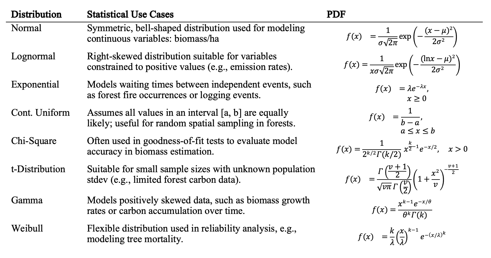
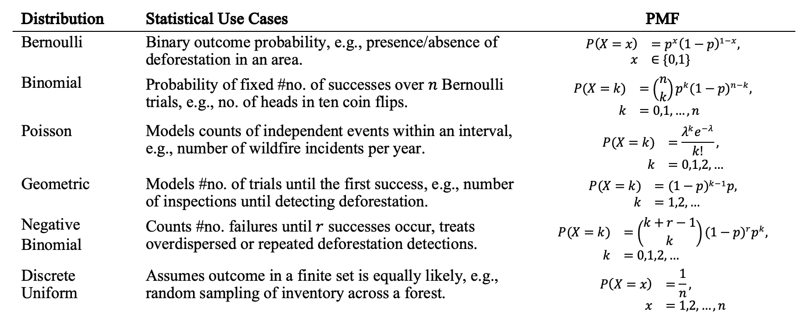

```{r setup-1}
#| warning: false
#| message: false
#| error: false
#| include: false
#| echo: false

easypackages::packages(
  "animation", "allodb", "BIOMASS", "c2z", "caret", 
  "dataMaid", "DescTools","dplyr",
  "extrafont", "FawR", "flextable", "ForestToolsRS", 
  "formatR", "ggplot2", "htmltools",
  "janitor", "jsonlite", 
  "kableExtra", "kernlab", 
  "latex2exp", "latexpdf", "lattice",
  "MASS","rmarkdown", "readxl", "reshape2","stats",
  "tibble", "tidymodels", "tidyverse",
  "tinytex", "truncnorm", "tune", "useful", "webshot", "webshot2", 
  prompt = F
  )
  
knitr::opts_chunk$set(
  echo    = TRUE, 
  message = FALSE, 
  warning = FALSE,
  error   = FALSE, 
  cache   = FALSE,
  comment = NA, 
  tidy.opts = list(width.cutoff = 60)
)

options(htmltools.dir.version = FALSE, htmltools.preserve.raw = FALSE)
knitr::opts_chunk$set(tidy.opts = list(width.cutoff = 80), tidy = TRUE)
```

```{css, echo=FALSE, class.source = 'foldable'}
div.column {
    display: inline-block;
    vertical-align: top;
    width: 50%;
}

#TOC::before {
  content: "";
  display: block;
  height: 80px;
  width: 210px;
  background-image: url(https://winrock.org/wp-content/uploads/2021/12/Winrock-logo-R.png);
  background-size: contain;
  background-position: center;
  background-position: 50% 50%;
  padding-top: 80px !important;
  background-repeat: no-repeat;
}
```

## Objective

When preparing for Monte Carlo simulations, it is best practice to start by examining descriptive statistics to characterize the
empirical distributions of input variables. This preliminary analysis typically includes statistical tests for normality and
visualizations of univariate distributions, such as histograms, kernel density plots, and Q-Q plots. Together, these tools provide
critical insights into the shape, spread, symmetry, skewness, and presence of potential outliers in the data. Although this
preliminary step may seem minor, it substantially influences uncertainty estimates, which can directly translate into increased
financial returns, particularly within forest project landscapes exhibiting non-normal data distributions.

Accurately characterizing data distributions also helps in identifying and addressing biases, thereby ensuring high data quality
and increasing confidence in subsequent estimations of biomass and carbon emissions. Selecting appropriate statistical
distributions, informed by exploratory analyses, significantly enhances the reliability and precision of Monte Carlo simulations.
Consequently, such careful statistical characterizations reduce overall uncertainty in forest biomass and emissions estimates. In
turn, this strengthens the credibility of jurisdictional claims made under REDD+ programs and maximizes potential financial
returns for Guyana from carbon financing initiatives.

Univariate distribution visualizations additionally provide auditors with useful diagnostic resources, enabling rapid
identification and characterization of biases commonly encountered in biomass data. These diagrams help auditors efficiently
assess the technical rigor and statistical approaches implemented by the project to monitor and manage uncertainty (ART, 2021: 8).
Winrock strongly recommends incorporating distribution analyses early in a project's quantitative planning and throughout its
technical standard operating procedures (SOPs). Such early integration represents a low hanging fruit with cost-effective strategy
and significant potential in reducing audit findings, lowering uncertainty, and enhancing financial outcomes for Guyana's REDD+
activities. Specifically, early attention to data distributions directly informs appropriate simulation selection from the
available options in SimVoi.

To effectively guide practitioners and stakeholders in selecting appropriate statistical distributions for Monte Carlo methods
within forestry and REDD+ contexts, the following two tables present findings from a rapid review of relevant literature. The
review identified and summarized statistical distributions frequently encountered in forestry, biomass estimation, and emissions
analysis, which are dis-aggregated below between discrete and continuous types and according to their inherent statistical
characteristics.

###### *Table 1: Continuous data distributions, example cases & equations used in Monte Carlo simulations.*



###### *Table 2: Discrete data distributions, example cases & equations used in Monte Carlo simulations.*



Discrete distributions describe forestry monitoring scenarios where data outcomes are countable and finite. Common examples
include the number of deforestation events, occurrences of wildfires, or counts of logged trees within a defined monitoring
interval. Accurate representation of discrete events using appropriate distributions such as Binomial, Poisson, or Negative
Binomial significantly enhances the accuracy of model predictions and uncertainty assessments. For instance, employing a Poisson
distribution to model occurrences of illegal logging events can improve the precision of estimated deforestation emissions and
reduce uncertainty around compliance risks.

In contrast, continuous distributions capture variables capable of taking any value within a specified range and are particularly
relevant in forestry when modeling measurements such as tree heights, carbon stock densities, or biomass values. Continuous
distributions like the Normal (Gaussian), Lognormal, Weibull, and Gamma distributions frequently arise in ecological modeling and
biomass estimations due to their ability to realistically represent ecological variability and complex environmental factors. For
example, using a Lognormal distribution for tree biomass data often provides more reliable estimates, particularly when the
dataset is right-skewed due to natural variability in tree growth and forest conditions.

Central to these distributions are two mathematical concepts: Probability Mass Functions (PMFs) for discrete data and Probability
Density Functions (PDFs) for continuous data. PMFs allocate specific probabilities to discrete outcomes, essential for accurately
simulating events such as species occurrences or forest disturbances. PDFs describe the relative likelihood of continuous data
points, enabling the robust estimation of variables like forest carbon content or annual biomass increment.

In Monte Carlo simulations, precise definition and utilization of PMFs and PDFs are crucial. These functions underpin random
sampling processes that directly influence the reliability, precision, and credibility of uncertainty estimates. Given that
forestry data is known to exhibit non-normal distributions due to inherent ecological heterogeneity that, informed selection and
rigorous application of these functions are vital. Accurate modeling of the underlying data distribution enhances biomass and
emissions estimates, significantly reduces uncertainty, and bolsters the financial and ecological credibility of REDD+ reporting
initiatives (Morgan & Henrion, 1990; IPCC, 2019; ART, 2021).

Practitioners are encouraged to conduct exploratory data analysis early in their project planning stages, integrating statistical
tests of normality and visual assessments (histograms, kernel density plots, Q-Q plots). Such preliminary analyses assist in
diagnosing data distributions accurately, improving model selection, reducing potential auditor findings, and ultimately enhancing
the financial and environmental outcomes of national REDD+ monitoring programs.

## Method

***Import***

```{r, class.source = c("numCode", "r", "numberLines"), fig.show='hold', out.height="50%", message=T, comment=NA,error=F,warning=F}
# Point this to the correct path where your file is located:
workbook  = "./data/art/GuyanaARTWorkbookMC-thru2022-April2024_values_V2.xlsx"
CarbonStocks = readxl::read_excel(workbook, "CarbonStocks") |> 
  janitor::clean_names() |> mutate(across(where(is.numeric), ~ round(.x, 1)))
CarbonStocks_MC = readxl::read_excel(workbook, "CarbonStocks (MC)") |> 
  janitor::clean_names() |> mutate(across(where(is.numeric), ~ round(.x, 1)))

DeforestationEF = readxl::read_excel(workbook, "Deforestation EFs") |> janitor::clean_names()|> 
  mutate(across(where(is.numeric), ~ round(.x, 1)))
DeforestationEF_MC = readxl::read_excel(workbook,"Deforestation EFs (MC)")|>janitor::clean_names()|> 
  mutate(across(where(is.numeric), ~ round(.x, 1)))

DegradationEF = readxl::read_excel(workbook, "Degradation EFs") |> janitor::clean_names()|> 
  mutate(across(where(is.numeric), ~ round(.x, 1)))
DegradationEF_MC = readxl::read_excel(workbook, "Degradation EFs (MC)")|>janitor::clean_names()|>  
  mutate(across(where(is.numeric), ~ round(.x, 1)))

ActivityData = readxl::read_excel(workbook, "Activity Data") |> janitor::clean_names() |> 
  mutate(across(where(is.numeric), ~ round(.x, 1)))
ActivityData_MC = readxl::read_excel(workbook, "Activity Data (MC)") |> janitor::clean_names() |> 
  mutate(across(where(is.numeric), ~ round(.x, 1)))

# Tabulate
#flextable(head(CarbonStocks_MC[, 1:8])) |> fontsize(size = 8, part = "all")
#flextable(head(DeforestationEF_MC[, 1:8])) |> fontsize(size = 8, part = "all")
#flextable(head(DegradationEF_MC[, 1:3])) |> fontsize(size = 8, part = "all")
#flextable(head(ActivityData_MC[, 1:8])) |> fontsize(size = 8, part = "all")
flextable(head(ActivityData[, 1:6])) |> fontsize(size = 8, part = "all")
flextable(head(DeforestationEF[, 1:8])) |> fontsize(size = 8, part = "all")
flextable(head(DegradationEF[, 1:8])) |> fontsize(size = 8, part = "all")
flextable(head(CarbonStocks[, 1:8])) |> fontsize(size = 8, part = "all")
dplyr::glimpse(CarbonStocks)
```

### Tidy

Data cleaning tasks are often needed in dataframes imported with `readxl::read_exel()` function when variable labels and
dimensions get corrupted in the process. This especially likely with summary statistics in non-standard formats, such as in
Guyana's workbook data. Re-installing and applying the function `janitor::clean_names()` may sometimes solve this, but more often
not. For future debugging, I added notes in this Tidy section on the steps identified to complete data cleaning.

We begin by identifying the relevant rows and columns for each pool, specifically those containing mean, standard deviation,
minimum, maximum, and confidence interval values. Assuming rows in the "CarbonStocks_MC" tab maintain the same order, these
cleaning operations can hopefully be repeated quickly. A common approach involves reshaping the data so that each row represents a
"Statistic," such as mean or standard deviation, and each column corresponds to a carbon pool, like "AG Tree" or "BG Tree."

In the chunk below we select columns pertinent to carbon pools, including "AG Tree (tC/ha)", "BG Tree (tC/ha)," and rename them to
match the "SimVoi" workbook. Subsequently, we extract the rows containing the summary statistics, and reshape the data to our
preferred layout. To effectively transpose the data and transition between wide and long formats, utilize the `tidyr` package's
`pivot_longer()` and `pivot_wider()` functions, which essentially flip rows and columns. Finally, you must pivot back from long to
wide layout to ensure that "Statistic" becomes a distinct column and the carbon pools, such as "AG_Tree" and "BG_Tree," are
represented as separate variable columns. Happy to walk you through this again if you need.

```{r, class.source =c("numCode","r","numberLines"), fig.show='hold',out.height="50%", eval=F}

```

### Distribution Analysis

```{r, eval=F}
# Descriptive statistics
psych::describe(CarbonStocks)
```

```{r, eval=F}
psych::describe(DeforestationEF)
psych::describe(DegradationEF)
psych::describe(ActivityData)

MASS::truehist(CarbonStocks$ag_tree_t_c_ha,xlab= "ag_tree_t_c_ha",main=paste("Distribution of", "ag_tree_t_c_ha"),col = "gray")
MASS::truehist(CarbonStocks$bg_tree_t_c_ha,nbins=30,xlab= "bg_tree_t_c_ha",main=paste("Distribution of", "bg_tree_t_c_ha"),col = "gray")
MASS::truehist(CarbonStocks$saplings_t_c_ha,nbins=30,xlab= "saplings_t_c_ha",main=paste("Distribution of", "saplings_t_c_ha"),col = "gray")
```

```{r, warning=FALSE}
# Shapiro–Wilk normality test
normalityTests <- function(data) {
  numericData <- data[sapply(data, is.numeric)]
  results <- sapply(numericData, function(x) {
    x_clean <- na.omit(x)
    if (length(x_clean) >= 3 && length(x_clean) <= 5000) {
      test <- shapiro.test(x_clean)
      c(W = test$statistic, p.value = test$p.value)
    } else {c(W = NA, p.value = NA)}})
  results_df <- as.data.frame(t(results))
  return(results_df)
  }

# Function to plot kernel density plots with p-values annotated in facet labels
plotKernelDensitiesWithNormality <- function(data) {
  numericData <- data[sapply(data, is.numeric)]
  meltedData <- melt(numericData, variable.name = "Variable", value.name = "Value")
  norm_results <- normalityTests(data)
  norm_results$Variable <- rownames(norm_results)
  norm_results$p.value.formatted <- sprintf("p = %.3f", norm_results$p.value)
  facet_labels <- setNames(paste0(
    norm_results$Variable, "\n", norm_results$p.value.formatted), norm_results$Variable)
  ggplot(meltedData, aes(x = Value)) +
    geom_density(fill = "steelblue", alpha = 0.6) +
    facet_wrap(~ Variable, scales = "free", ncol = 3, labeller = as_labeller(facet_labels)) +
    theme_minimal() +
    labs(title = "Kernel Density Plots with Normality Test p-values",
         x = "Value", y = "Density")
  }

# Deploy:
norm_results <- normalityTests(CarbonStocks)
print(norm_results)
plotKernelDensitiesWithNormality(CarbonStocks)
```

The Coefficient of Variation `CV` is a standardized, unit-less measure of dispersion defined as the ratio of the standard
deviation to the mean, typically expressed as a percentage. This standardization enables comparison of variability across datasets
or scales, regardless of the underlying units, offering helpful tool for assessing novel data from periodic field inventories or
mapping updates.

$$
\mathrm{CV} = \frac{\sigma}{\mu} \times 100\%
$$

$$
\mathrm{CV}_{\%} = 100 \times \frac{\text{std. dev}}{\text{mean of all plots (calculated)}}
$$

For these carbon stocks, a higher CV indicates greater relative variability or "scatter" in the data. While the CV is a useful
indicator of dispersion and can signal potential non-normality, it does not provide any information on the direction of skew in
the distribution.

In the following, the CV variable was computed from within the larger helper function `calc_derived_stats`. This helper function
was designed as an aggregated relational estimate, which calculates CV while also comparing the reported 90% confidence interval
with the standard deviation, which, under assumed normality, should approximate to ±1.645 × SD. This iterative scoring helps
assess the internal consistency of the reported descriptive statistics.

```{r, class.source = c("numCode", "r", "numberLines"), fig.show='hold', out.height="50%", eval=FALSE}
# Helper function of derived descriptive statistics:
calc_derived_stats <- function(df) {
  df %>% mutate(
      CV_percent = 100 * (`std_dev` / `mean of all plots (calculated)`),
      sd_implied_by_90CI = `90% CI` / 1.645,
      SDs_below_mean = (`mean of all plots (calculated)` - minimum) / `std. dev`,
      SDs_above_mean = (maximum - `mean of all plots (calculated)`) / `std. dev`
    )
}

CarbonStocks_stats <- calc_derived_stats(CarbonStocks) 
```

## Replicating SimVoi

We utilize the replicate function to repeat a simulation following a randomized normally truncated multiple times with
`replicate(n=10000`, while determining the size of the sampled subset with `rnorm(n=100`. The first model explores sample size
parameters only, replication parameters are tested below this in comparisons.

```{r, eval=FALSE}

```

## Compare simulations

```{r, class.source = c("numCode", "r", "numberLines"), fig.show='hold', out.height="50%", eval=F, message=F, warning=F, comment=NA}
A_MEAN = CarbonStocks$ag_tree_t_c_ha[1]
A_SD   = CarbonStocks$ag_tree_t_c_ha[2]
B_MEAN = CarbonStocks$bg_tree_t_c_ha[1]
B_SD   = CarbonStocks$bg_tree_t_c_ha[2]
C_MEAN = CarbonStocks$saplings_t_c_ha[1]
C_SD   = CarbonStocks$saplings_t_c_ha[2]
D_MEAN = CarbonStocks$standing_dead_wood_t_c_ha[1]
D_SD   = CarbonStocks$standing_dead_wood_t_c_ha[2]
E_MEAN = CarbonStocks$lying_dead_wood_t_c_ha[1]
E_SD   = CarbonStocks$lying_dead_wood_t_c_ha[2]
F_MEAN = CarbonStocks$sum_carbon_pools_w_o_litter_t_c_ha[1]
F_SD   = CarbonStocks$sum_carbon_pools_w_o_litter_t_c_ha[2]
G_MEAN = CarbonStocks$litter_t_c_ha[1]
G_SD   = CarbonStocks$litter_t_c_ha[2]
H_MEAN = CarbonStocks$soil_t_c_ha[1]
H_SD   = CarbonStocks$soil_t_c_ha[2]


# 10,000 simulations sampling 1 observation
A_rtruncnormal_100 = truncnorm::rtruncnorm(n=100,a=0,b=Inf,A_MEAN, A_SD)
B_rtruncnormal_100 = truncnorm::rtruncnorm(n=100,a=0,b=Inf,B_MEAN, B_SD)
C_rtruncnormal_100 = truncnorm::rtruncnorm(n=100,a=0,b=Inf,C_MEAN, C_SD)
D_rtruncnormal_100 = truncnorm::rtruncnorm(n=100,a=0,b=Inf,D_MEAN, D_SD)
E_rtruncnormal_100 = truncnorm::rtruncnorm(n=100,a=0,b=Inf,E_MEAN, E_SD)
F_rtruncnormal_100 = truncnorm::rtruncnorm(n=100,a=0,b=Inf,F_MEAN, F_SD)
G_rtruncnormal_100 = truncnorm::rtruncnorm(n=100,a=0,b=Inf,G_MEAN, G_SD)
H_rtruncnormal_100 = truncnorm::rtruncnorm(n=100,a=0,b=Inf,H_MEAN, H_SD)

hist(A_rtruncnormal_100, freq=F)
hist(B_rtruncnormal_100, freq=F)
hist(C_rtruncnormal_100, freq=F)
hist(D_rtruncnormal_100, freq=F)
hist(E_rtruncnormal_100, freq=F)
hist(F_rtruncnormal_100, freq=F)
hist(G_rtruncnormal_100, freq=F)
hist(H_rtruncnormal_100, freq=F)

mean(A_rtruncnormal_100)
mean(A_rtruncnormal_100)*(44/12)
mean(B_rtruncnormal_100)
mean(B_rtruncnormal_100)*(44/12)
mean(C_rtruncnormal_100)
mean(C_rtruncnormal_100)*(44/12)
mean(D_rtruncnormal_100)
mean(D_rtruncnormal_100)*(44/12)
mean(E_rtruncnormal_100)
mean(E_rtruncnormal_100)*(44/12)
mean(F_rtruncnormal_100)
mean(F_rtruncnormal_100)*(44/12)
mean(G_rtruncnormal_100)
mean(G_rtruncnormal_100)*(44/12)
mean(H_rtruncnormal_100)
mean(H_rtruncnormal_100)*(44/12)
```

## Annex I: SimVoi Functions & Syntax

SimVoi provides seventeen random number generator functions defined with the following syntax:

-   `RandBeta(alpha,beta,,[MinValue],[MaxValue])`
-   `RandBinomial(trials,probability_s)`
-   `RandBiVarNormal(mean1,stdev1,mean2,stdev2,correl12)`
-   `RandCumulative(value_cumulative_table)`
-   `RandDiscrete(value_discrete_table)`
-   `RandExponential(lambda)`
-   `RandInteger(bottom,top)`
-   `RandLogNormal(Mean,StDev)`
-   `RandNormal(mean,standard_dev)`
-   `RandPoisson(mean)`
-   `RandSample(population)`
-   `RandTriangular(minimum,most_likely,maximum)`
-   `RandTriBeta(minimum,most_likely,maximum,[shape])`
-   `RandTruncBiVarNormal(mean1,stdev1,mean2,stdev2,correl12, [min1],[max1],[min2],[max2])`
-   `RandTruncLogNormal(Mean,StDev,[MinValue],[MaxValue])`
-   `RandTruncNormal(Mean,StDev,[MinValue],[MaxValue])`
-   `RandUniform(minimum,maximum)`

In the following, we attempt to match the SimVoi Excel formula of

`=[1]!randtruncnormal(CarbonStocks.B2,CarbonStocks.B3,0)`

function, as closely as random seeding allows. According to package documentation, the `RandTruncNormal()` function "*Returns a
random value from a truncated normal probability density function. This function can model an uncertain quantity with a
bell-shaped density function where extreme values in the tails of the distribution are not desired."*

In terms of simulation parameters, *"RandTruncNormal(Mean,StDev,MinValue,MaxValue)) uses values of RandNormal until a value is
found between MinValue and MaxValue or until it has made 10,000 attempts."* The above formula provides a minimum value of `0`,
passing to the default number of simulations of 10,000.

## Annex II: Rapid literature review of Monte Carlo methods in REDD+

###### *Table A.2: Search parameters, resource scope, and objectives informing search*

|  |  |  |  |
|---------------------------------|:--------------------------------|:--------------------------------|:--------------------------------|
| **REDD+**[^1] | **MC Application** | **Region** | **Key Findings** |
| ADD | Uncertainty of SAAB estimate | Rondônia, Brazil | Estimated ± 20% measurement error in SAAB using Monte Carlo simulations; emphasized large trees’ role in biomass. |
| ADD | AGB Uncertainty | Kenya, Mozambique | Assessed mixed-effects models in estimating mangrove biomass. |
| ADD | Blanket uncertainty propagation | Ghana | AGB prediction error \>20%; addressed error propagation from trees to pixels in remote sensing. |
| ADD | Plot-based uncertainty | New Zealand | Cross-plot variance greatest magnitude of uncertainty |
| JNR | Multi-scale AGB uncertainty modeling | Minnesota, USA | Cross-scale tests showing effects of spatial resolution on AGB uncertainty. |
| N/A | Allometric uncertainty modeling | Panama | Allometric models identified as largest source of biomass estimation error. |
| ADD | Sampling and allometric uncertainty | Tapajos Nat Forest, Brazil | Significance of allometric models on uncertainty of root biomass, 95% CI, 21 plots. |
| ADD | Uncertainty of volume estimates | Santa Catarina, Brazil | Negligible effects of residual uncertainty on large-area estimates |
| N/A | Uncertainty metrics in model selection | Oregon, USA | Uncertainty estimates call for local validation or new local model development |
| ADD | AGB model uncertainty | French Guiana | AGB sub-model errors dominate uncertainty; height and wood-specific gravity errors are minor but can cause bias. |
| IFM | Emission factor uncertainty | Central Africa | Model selection is the largest error source (40%); weighting models reduces uncertainty in emission factors. |
| NA | Uncertainty in ecosystem nutrient estimate | New Hampshire, USA | Identified 8% uncertainty in nitrogen budgets, mainly from plot variability (6%) and allometric errors (5%). |

[^1]: 1\. ADD: Avoided deforestation degradation, IFM: Improved forest management, JNR: Jurisdictional nested REDD+

## Annex III: Custom simulations using base functions

```{r, eval=F}
randtruncnormal_sim_10000 <- rnorm(n=10,mean=MEAN,sd=SD)
hist(randtruncnormal_sim_10000, freq=F)
AG_Tree_tC_ha   = mean(randtruncnormal_sim_10000)
AG_Tree_tCO2_ha = AG_Tree_tC_ha*(44/12)
AG_Tree_tC_ha
AG_Tree_tCO2_ha
#curve(dnorm(x, mean=MEAN, sd=SD), from=0, to=450, add=T, col="red")

# 10,000 simulations sampling 10 observations
randtruncnormal_sim_10000_10 = replicate(n=10000, rnorm(n=10,mean=MEAN,sd=SD))
hist(apply(X = randtruncnormal_sim_10000_10, MARGIN=2, FUN=mean))
sd(apply(X = randtruncnormal_sim_10000_10, MARGIN=2, FUN=mean))
mean(apply(X = randtruncnormal_sim_10000_10, MARGIN=2, FUN=mean))
(mean(apply(X = randtruncnormal_sim_10000_10, MARGIN=2, FUN=mean)))*(44/12)

# 10,000 simulations sampling 100 observations
randtruncnormal_sim_10000_100 = replicate(n=10000,rnorm(n=100,mean=MEAN,sd=SD))
hist(apply(X = randtruncnormal_sim_10000_100, MARGIN=2, FUN=mean))
sd(apply(X = randtruncnormal_sim_10000_100, MARGIN=2, FUN=mean))
mean(apply(X = randtruncnormal_sim_10000_100, MARGIN=2, FUN=mean))
(mean(apply(X = randtruncnormal_sim_10000_100, MARGIN=2, FUN=mean)))*(44/12)

# 10,000 simulations sampling 1,000 observations
randtruncnormal_sim_10000_1000 = replicate(n=10000, rnorm(n=1000,mean=MEAN,sd=SD))
hist(apply(X = randtruncnormal_sim_10000_1000, MARGIN=2, FUN=mean))
sd(apply(X = randtruncnormal_sim_10000_1000, MARGIN=2, FUN=mean))
mean(apply(X = randtruncnormal_sim_10000_1000, MARGIN=2, FUN=mean))
(mean(apply(X = randtruncnormal_sim_10000_1000, MARGIN=2, FUN=mean)))*(44/12)

# 10,000 simulations sampling 10,000 observations
randtruncnormal_sim_10000_10000 = replicate(n=10000,rnorm(n=10000,mean=MEAN,sd=SD))
hist(apply(X = randtruncnormal_sim_10000_10000, MARGIN=2, FUN=mean))
sd(apply(X = randtruncnormal_sim_10000_10000, MARGIN=2, FUN=mean))
mean(apply(X = randtruncnormal_sim_10000_10000, MARGIN=2, FUN=mean))
(mean(apply(X = randtruncnormal_sim_10000_10000, MARGIN=2, FUN=mean)))*(44/12)
```

## References

(1) ART, S. *The REDD+ Environmental Excellence Standard*; 2021.
    <https://www.artredd.org/wp-content/uploads/2021/12/TREES-2.0-August-2021-Clean.pdf>.

(2) Bolker, B. (2008). *Ecological Models and Data in R.* Princeton University Press.

(3) Brown, I. F.; Foster Brown, I.; Martinelli, L. A.; Wayt Thomas, W.; Moreira, M. Z.; Cid Ferreira, C. A.; Victoria, R. A.
    Uncertainty in the Biomass of Amazonian Forests: An Example from Rondônia, Brazil. *Forest Ecology and Management* 1995, *75*
    (1–3), 175–189. [https://doi.org/10.1016/0378-1127(94)03512-u](https://doi.org/10.1016/0378-1127(94)03512-u).

(4) Cohen, R.; Kaino, J.; Okello, J. A.; Bosire, J. O.; Kairo, J. G.; Huxham, M.; Mencuccini, M. Uncertainty to Estimates of
    Above-Ground Biomass for Kenyan Mangroves: A Scaling Procedure from Tree to Landscape Level. In *Forest ecology and
    management*; 2013; Vol. 310, pp 968–982. <https://doi.org/10.1016/j.foreco.2013.09.047>.

(5) Chen, Q.; Laurin, G. V.; Valentini, R. Uncertainty of Remotely Sensed Aboveground Biomass over an African Tropical Forest:
    Propagating Errors from Trees to Plots to Pixels. *Remote Sensing of Environment* 2015, *160*, 134–143.
    [https://doi.org/10.1016/j.rse.2015.01.009](#0).

(6) Holdaway, R. J.; McNeill, S. J.; Mason, N. W. H.; Carswell, F. E. Propagating Uncertainty in Plot-Based Estimates of Forest
    Carbon Stock and Carbon Stock Change. *Ecosystems* 2014, *17*, 627–640. [https://doi.org/10.1007/s10021-014-9749-5](#0).

(7) Chen, Q.; McRoberts, R. E.; Wang, C.; Radtke, P. J. Forest Aboveground Biomass Mapping and Estimation Across Multiple Spatial
    Scales Using Model-Based Inference. *Remote Sensing of Environment* 2016, *184*, 350–360.
    <https://doi.org/10.1016/j.rse.2016.07.023>.

(8) Chave, J.; Condit, R.; Aguilar, S.; Hernandez, A.; Lao, S.; Perez, R. Error Propagation and Scaling for Tropical Forest
    Biomass Estimates. *Philosophical Transactions of the Royal Society of London. Series B: Biological Sciences* 2004, *359*
    (1443), 409–420.

(9) Keller, M.; Palace, M.; Hurtt, G. Biomass Estimation in the Tapajos National Forest, Brazil. *Forest Ecology and Management*
    2001, *154*, 371–382.

(10) McRoberts, R. E.; Moser, P.; Oliveira, L. Z.; Vibrans, A. C. A General Method for Assessing the Effects of Uncertainty in
     Individual-Tree Volume Model Predictions on Large-Area Volume Estimates 222 with a Subtropical Forest Illustration. *Canadian
     Journal of Forest Research* 2015, *45*.

(11) Melson, S. L.; Harmon, M. E.; Fried, J. S.; Domingo, J. B. Estimates of Live-Tree Carbon Stores in the Pacific Northwest Are
     Sensitive to Model Selection. *Carbon Balance and Management* 2011, *6*, 2.

(12) Molto, Q.; Rossi, V.; Blanc, L. Error Propagation in Biomass Estimation in Tropical Forests. *Methods in Ecology and
     Evolution* 2013, *4*, 175–183. <https://doi.org/10.1111/j.2041-210x.2012.00266.x>.

(13) Picard, N.; Bosela, F. B.; Rossi, V. Reducing the Error in Biomass Estimates Strongly Depends on Model Selection. *Annals of
     Forest Science* 2015, *72* (6), 811–823. <https://doi.org/10.1007/s13595-014-0434-9>.

(14) Yanai, R. D.; Battles, J. J.; Richardson, A. D.; Blodgett, C. A.; Wood, D. M.; Rastetter, E. B. Estimating Uncertainty in
     Ecosystem Budget Calculations. *Ecosystems* 2010, *13*, 239–248. <https://doi.org/10.1007/s10021-010-9315-8>.

(15) Limpert, E., Stahel, W. A., & Abbt, M. (2001). "Log-normal distributions across the sciences: Keys and clues." *BioScience*,
     51(5), 341–352.

(16) Morgan, M. G., & Henrion, M. (1990). *Uncertainty: A Guide to Dealing with Uncertainty in Quantitative Risk and Policy
     Analysis.* Cambridge University Press.

(17) Ross, S. M. (2019). *Introduction to Probability Models* (12th ed.). Academic Press.

```{r, class.source = c("numCode", "r", "numberLines"), fig.show='hold', out.height="50%"}
devtools::session_info()
#Sys.getenv()
#.libPaths()
```
