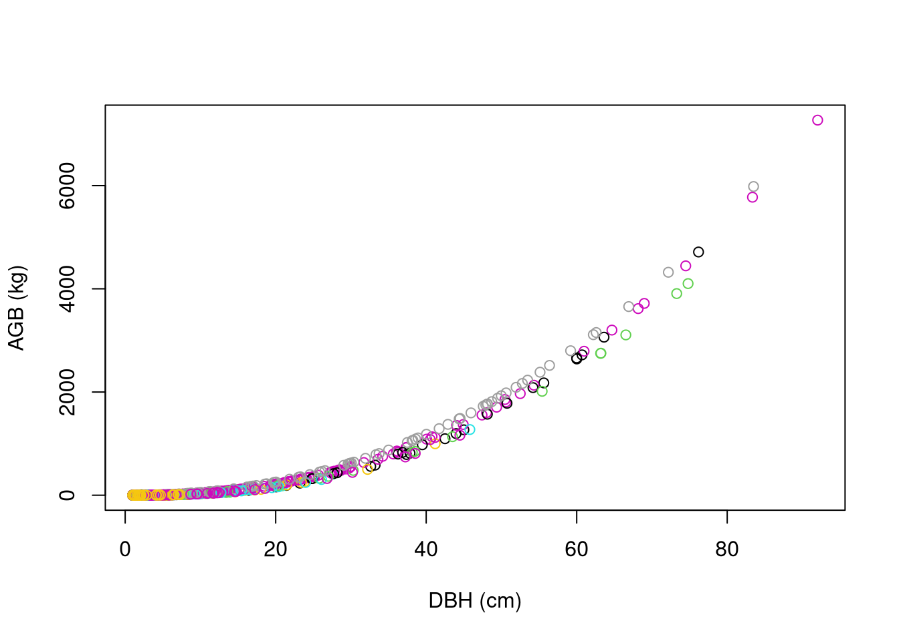
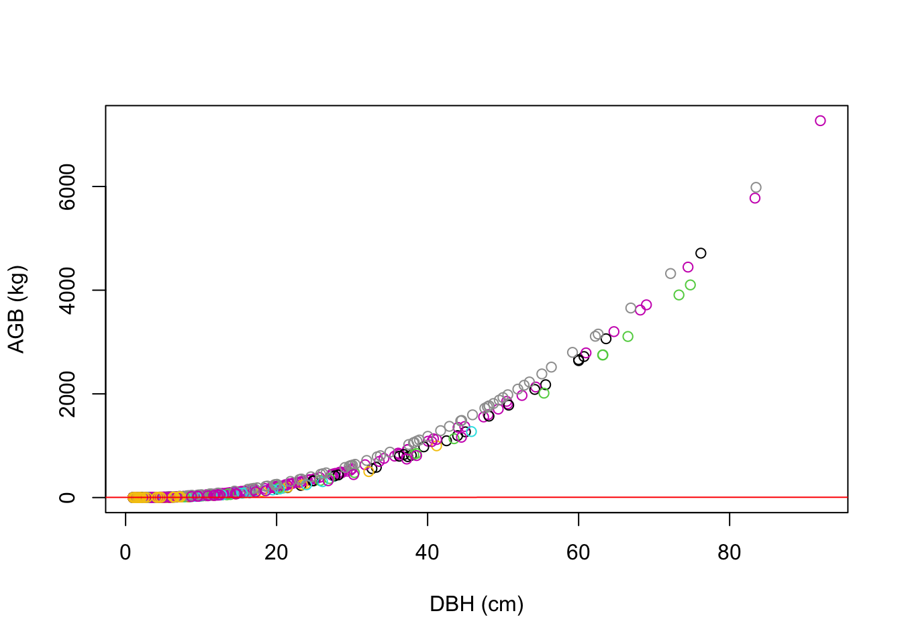
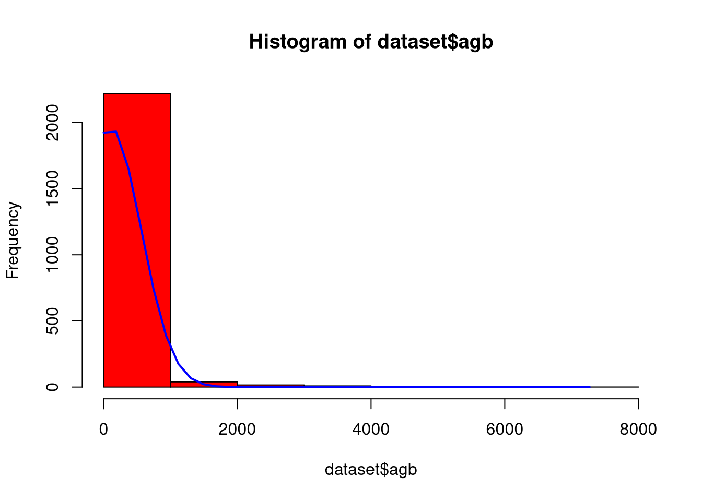
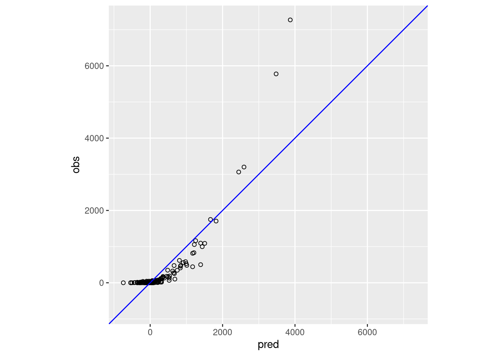

# Introduction


::: {.cell}
::: {.cell-output-display}

:::
:::


#### Scope of Work

Excel tool design published \[here\] (https://www.artredd.org/wp-content/uploads/2021/12/MC-4-estimating-ER-from-forests-update-1-1.xlsx)

## Import data {#sec-1.1}


::: {.cell}

```{.r .cell-code}
set.seed(333)
#data(ufc) # spuRs::vol.m3(dataset$dbh.cm, dataset$height.m, multiplier = 0.5)
data(scbi_stem1)
dataset   = scbi_stem1
head(dataset) |> kbl(
  caption = "Table 1: Dataset from Smithsonian Institute provided by allodb package (n = 2287") |>
  kable_styling() 
```

::: {.cell-output-display}

`````{=html}
<table class="table" style="margin-left: auto; margin-right: auto;">
<caption>Table 1: Dataset from Smithsonian Institute provided by allodb package (n = 2287</caption>
 <thead>
  <tr>
   <th style="text-align:right;"> treeID </th>
   <th style="text-align:right;"> stemID </th>
   <th style="text-align:right;"> dbh </th>
   <th style="text-align:left;"> genus </th>
   <th style="text-align:left;"> species </th>
   <th style="text-align:left;"> Family </th>
  </tr>
 </thead>
<tbody>
  <tr>
   <td style="text-align:right;"> 2695 </td>
   <td style="text-align:right;"> 2695 </td>
   <td style="text-align:right;"> 1.41 </td>
   <td style="text-align:left;"> Acer </td>
   <td style="text-align:left;"> negundo </td>
   <td style="text-align:left;"> Sapindaceae </td>
  </tr>
  <tr>
   <td style="text-align:right;"> 1229 </td>
   <td style="text-align:right;"> 38557 </td>
   <td style="text-align:right;"> 1.67 </td>
   <td style="text-align:left;"> Acer </td>
   <td style="text-align:left;"> negundo </td>
   <td style="text-align:left;"> Sapindaceae </td>
  </tr>
  <tr>
   <td style="text-align:right;"> 1230 </td>
   <td style="text-align:right;"> 1230 </td>
   <td style="text-align:right;"> 1.42 </td>
   <td style="text-align:left;"> Acer </td>
   <td style="text-align:left;"> negundo </td>
   <td style="text-align:left;"> Sapindaceae </td>
  </tr>
  <tr>
   <td style="text-align:right;"> 1295 </td>
   <td style="text-align:right;"> 32303 </td>
   <td style="text-align:right;"> 1.04 </td>
   <td style="text-align:left;"> Acer </td>
   <td style="text-align:left;"> negundo </td>
   <td style="text-align:left;"> Sapindaceae </td>
  </tr>
  <tr>
   <td style="text-align:right;"> 1229 </td>
   <td style="text-align:right;"> 32273 </td>
   <td style="text-align:right;"> 2.47 </td>
   <td style="text-align:left;"> Acer </td>
   <td style="text-align:left;"> negundo </td>
   <td style="text-align:left;"> Sapindaceae </td>
  </tr>
  <tr>
   <td style="text-align:right;"> 66 </td>
   <td style="text-align:right;"> 31258 </td>
   <td style="text-align:right;"> 2.19 </td>
   <td style="text-align:left;"> Acer </td>
   <td style="text-align:left;"> negundo </td>
   <td style="text-align:left;"> Sapindaceae </td>
  </tr>
</tbody>
</table>

`````

:::

```{.r .cell-code}
psych::describe(dataset)
```

::: {.cell-output-display}
<div class="kable-table">

|         | vars|    n|         mean|           sd|  median|      trimmed|          mad| min|      max|    range|       skew|   kurtosis|          se|
|:--------|----:|----:|------------:|------------:|-------:|------------:|------------:|---:|--------:|--------:|----------:|----------:|-----------:|
|treeID   |    1| 2287|  2778.658067|  1929.262548| 2525.00|  2705.540688| 2091.9486000|   1|  6207.00|  6206.00|  0.2717859| -1.1051173|  40.3420768|
|stemID   |    2| 2287| 16577.120682| 16197.884045| 5022.00| 15661.273621| 5749.5228000|   1| 40180.00| 40179.00|  0.3961204| -1.7487292| 338.7078042|
|dbh      |    3| 2287|     5.520162|    10.803608|    1.67|     2.653741|    0.7857782|   1|    92.02|    91.02|  3.8111843| 16.3042875|   0.2259101|
|genus*   |    4| 2287|    16.372540|     6.516571|   18.00|    16.712725|    0.0000000|   1|    31.00|    30.00| -0.5713109|  0.1413179|   0.1362655|
|species* |    5| 2287|    13.256231|     9.600139|    8.00|    11.305298|    0.0000000|   1|    40.00|    39.00|  1.5869799|  1.2976632|   0.2007449|
|Family*  |    6| 2287|    13.068212|     4.021778|   13.00|    13.334244|    0.0000000|   1|    22.00|    21.00| -0.5763674|  1.4407792|   0.0840979|

</div>
:::

```{.r .cell-code}
str(dataset)
```

::: {.cell-output .cell-output-stdout}

```
tibble [2,287 × 6] (S3: tbl_df/tbl/data.frame)
 $ treeID : int [1:2287] 2695 1229 1230 1295 1229 66 2600 4936 1229 1005 ...
 $ stemID : int [1:2287] 2695 38557 1230 32303 32273 31258 2600 4936 36996 1005 ...
 $ dbh    : num [1:2287] 1.41 1.67 1.42 1.04 2.47 ...
 $ genus  : chr [1:2287] "Acer" "Acer" "Acer" "Acer" ...
 $ species: chr [1:2287] "negundo" "negundo" "negundo" "negundo" ...
 $ Family : chr [1:2287] "Sapindaceae" "Sapindaceae" "Sapindaceae" "Sapindaceae" ...
```


:::
:::


## Probability density functions


::: {.cell layout-ncol="3"}

```{.r .cell-code}
# add allometry database
data(equations)
data("equations_metadata")
show_cols   = c("equation_id", "equation_taxa", "equation_allometry")
eq_tab_acer = new_equations(subset_taxa = "Acer")
kable(head(eq_tab_acer[, show_cols]))
```

::: {.cell-output-display}


|equation_id |equation_taxa       |equation_allometry                                       |
|:-----------|:-------------------|:--------------------------------------------------------|
|a4e4d1      |Acer saccharum      |exp(-2.192-0.011*dbh+2.67*(log(dbh)))                    |
|dfc2c7      |Acer rubrum         |2.02338*(dbh^2)^1.27612                                  |
|eac63e      |Acer rubrum         |5.2879*(dbh^2)^1.07581                                   |
|f49bcb      |Acer pseudoplatanus |exp(-5.644074+(2.5189*(log(pi*dbh))))                    |
|14bf3d      |Acer mandshuricum   |0.0335*(dbh)^1.606+0.0026*(dbh)^3.323+0.1222*(dbh)^2.310 |
|0c7cd6      |Acer mono           |0.0202*(dbh)^1.810+0.0111*(dbh)^2.740+0.1156*(dbh)^2.336 |


:::

```{.r .cell-code}
# Compute above ground biomass
dataset$agb = allodb::get_biomass(
    dbh     = dataset$dbh,
    genus   = dataset$genus,
    species = dataset$species,
    coords  = c(-78.2, 38.9)
  )

# examine dbh ~ agb function
dbh_agb = lm(dbh ~ agb, data = dataset)
#olsrr::ols_test_breusch_pagan(lm(dbh_agb)) #<0.0000
#h = lattice::histogram(dbh ~ agb, data = dataset)
plot(
  x    = dataset$dbh,
  y    = dataset$agb,
  col  = factor(scbi_stem1$genus),
  xlab = "DBH (cm)",
  ylab = "AGB (kg)"
)
```

::: {.cell-output-display}
{width=672}
:::

```{.r .cell-code}
# examine univariate distributions
h1 = hist(dataset$dbh, breaks=10, col="red")
xfit<-seq(min(dataset$dbh),max(dataset$dbh),length=40)
yfit<-dnorm(xfit,mean=mean(dataset$dbh),sd=sd(dataset$dbh))
yfit <- yfit*diff(h1$mids[1:2])*length(dataset$dbh)
lines(xfit, yfit, col="blue", lwd=2)
```

::: {.cell-output-display}
{width=672}
:::

```{.r .cell-code}
h2 = hist(dataset$agb, breaks=10, col="red")
xfit<-seq(min(dataset$agb),max(dataset$agb),length=40)
yfit<-dnorm(xfit,mean=mean(dataset$agb),sd=sd(dataset$agb))
yfit <- yfit*diff(h2$mids[1:2])*length(dataset$agb)
lines(xfit, yfit, col="blue", lwd=2)
```

::: {.cell-output-display}
{width=672}
:::

```{.r .cell-code}
wilcox.test(dataset$dbh) # p<0.00001
```

::: {.cell-output .cell-output-stdout}

```

	Wilcoxon signed rank test with continuity correction

data:  dataset$dbh
V = 2616328, p-value < 2.2e-16
alternative hypothesis: true location is not equal to 0
```


:::

```{.r .cell-code}
wilcox.test(dataset$agb) # p<0.00001
```

::: {.cell-output .cell-output-stdout}

```

	Wilcoxon signed rank test with continuity correction

data:  dataset$agb
V = 2616328, p-value < 2.2e-16
alternative hypothesis: true location is not equal to 0
```


:::
:::


## Simulation Regime

The `LGOCV` acronym stands for "leave one group out cross validation". We must select the % of test data that is set out from the build upon which the model will be repeatedly trained.


::: {.cell}

```{.r .cell-code}
# Cross-validation split for bias detection
#samples     = caret::createDataPartition(dataset_tidy$volume, p = 0.80, list = FALSE)
#train_data  = dataset_tidy[samples, ]
#test_data   = dataset_tidy[-samples, ]

# Simulation pattern & regime
monte_carlo = trainControl(
  method    = "LGOCV",
  number    = 10,     # number of simulations
  p         = 0.8)     # percentage resampled


# Training model fit with all covariates (".") & the simulation
lm_monte_carlo = train(
  data      = dataset, 
  agb ~ ., 
  na.action = na.omit,
  trControl = monte_carlo)

lm_monte_carlo 
```

::: {.cell-output .cell-output-stdout}

```
Random Forest 

2287 samples
   6 predictor

No pre-processing
Resampling: Repeated Train/Test Splits Estimated (10 reps, 80%) 
Summary of sample sizes: 1832, 1832, 1832, 1832, 1832, 1832, ... 
Resampling results across tuning parameters:

  mtry  RMSE       Rsquared   MAE       
   2    334.19769  0.6035154  114.313008
  47     82.31374  0.9715600   13.758606
  93     49.07356  0.9898362    8.510285

RMSE was used to select the optimal model using the smallest value.
The final value used for the model was mtry = 93.
```


:::
:::


## Plot residuals

To enable access to these predictions, we need to instruct `caret` to retain the resampled predictions by setting `savePredictions = "final"` in our `trainControl()` function. It's important to be aware that if you’re working with a large dataset or numerous resampling iterations, the resulting `train()` object may grow significantly in size. This happens because `caret` must store a record of every row, including both the observed values and predictions, for each resampling iteration. By visualizing the results, we can offer insights into the performance of our model on the resampled data.


::: {.cell}

```{.r .cell-code}
monte_carlo_viz = trainControl(
  method    = "LGOCV", 
  p         = 0.8,            
  number    = 1,  # just for saving previous results
  savePredictions = "final") 

lm_monte_carlo_viz = train(
  agb ~ ., 
  data      = dataset, 
  method    = "lm",
  na.action = na.omit,
  trControl = monte_carlo_viz)

head(lm_monte_carlo_viz$pred)  # residuals 
```

::: {.cell-output-display}
<div class="kable-table">

|intercept |       pred|         obs| rowIndex|Resample  |
|:---------|----------:|-----------:|--------:|:---------|
|TRUE      | -109.35929|   0.1832042|        1|Resample1 |
|TRUE      |  -63.59706|   0.5637806|        6|Resample1 |
|TRUE      | -130.47898|   0.1832042|       10|Resample1 |
|TRUE      | -144.19036|   0.0994720|       12|Resample1 |
|TRUE      | -142.33348|   0.0949603|       15|Resample1 |
|TRUE      | 1222.08038| 789.4194743|       18|Resample1 |

</div>
:::

```{.r .cell-code}
lm_monte_carlo_viz$pred |> 
  ggplot(aes(x=pred,y=obs)) +
    geom_point(shape=1) + 
    geom_abline(slope=1, colour='blue')  +
    coord_obs_pred()
```

::: {.cell-output-display}
{width=672}
:::
:::


## Uncertainty Estimates


::: {.cell}

:::


**Monte Carlo cross-validation** (MCCV) involves randomly dividing the dataset into two parts: a training subset and a validation subset, without reusing data points. The model is trained on the training subset, denoted as ( n_t ), and assessed on the validation subset, ( n_v ). While there are ( \binom{N}{n_t} ) distinct ways to form the training subsets, MCCV bypasses the computational burden of evaluating all these combinations by sampling a smaller number of iterations. Zhang \[3\] demonstrated that performing MCCV for ( N ) iterations yields results comparable to exhaustive cross-validation over all possible subsets. However, studies investigating MCCV for large dataset sizes (( N )) remain limited.

The trade-off between bias and variance in MCCV is influenced by the choice of ( k ) (iterations) and ( n_t ) (training subset size). Increasing ( k ) or ( n_t ) tends to reduce bias but increases variance. Larger training subsets lead to greater similarity across iterations, which can result in overfitting to the training data. For a deeper analysis, see \[2\]. The bias-variance characteristics of ( k )-fold cross-validation (kFCV) and MCCV differ, but their bias levels can be aligned by selecting appropriate values for ( k ) and ( n_t ). A detailed comparison of the bias and variance for both approaches can be found in \[1\], where MCCV is referred to as the "repeated-learning testing-model."

------------------------------------------------------------------------

\[1\] Burman, P. (1989). A comparative study of ordinary cross-validation, ( v )-fold cross-validation, and the repeated learning testing-model methods. *Biometrika*, **76**, 503–514.

\[2\] Hastie, T., Tibshirani, R., & Friedman, J. (2011). *The Elements of Statistical Learning: Data Mining, Inference, and Prediction*. 2nd ed. New York: Springer.

\[3\] Zhang, P. (1993). Model selection via multifold cross-validation. *Annals of Statistics*, **21**, 299–313.
