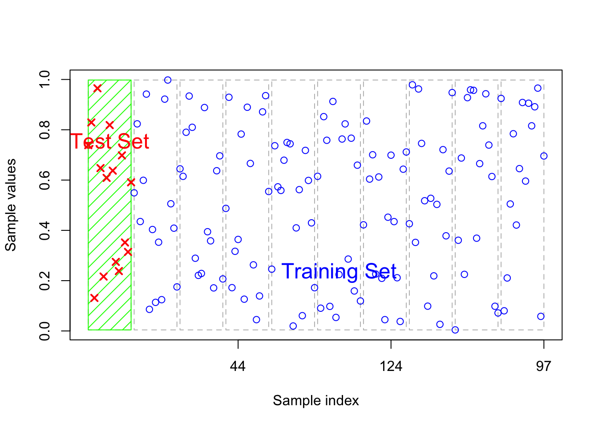
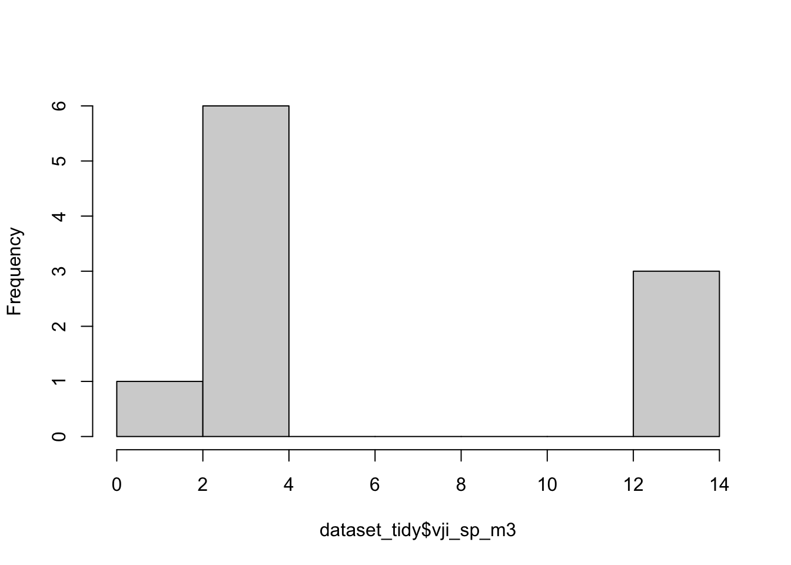

# Introduction

#### Scope of Work

## Import data {#sec-1.1}


::: {.cell}

```{.r .cell-code}
set.seed(333)
dataset_tidy = read.csv("./data/dataset_tidy.csv")
write.csv(dataset_tidy, "./data/dataset_tidy.csv", row.names = FALSE)
dataset_tidy |> kbl(caption = "Table 1: Dummy dataset derived for pilot test") |> kable_styling()
```

::: {.cell-output-display}

`````{=html}
<table class="table" style="margin-left: auto; margin-right: auto;">
<caption>Table 1: Dummy dataset derived for pilot test</caption>
 <thead>
  <tr>
   <th style="text-align:right;"> stratum_i </th>
   <th style="text-align:right;"> plot_sp </th>
   <th style="text-align:left;"> species_j </th>
   <th style="text-align:left;"> tree_l </th>
   <th style="text-align:right;"> volume </th>
   <th style="text-align:right;"> bcef_r </th>
   <th style="text-align:right;"> cf </th>
   <th style="text-align:right;"> d </th>
   <th style="text-align:right;"> a_sp </th>
   <th style="text-align:right;"> a_sp_m2 </th>
   <th style="text-align:right;"> a_I_m2 </th>
   <th style="text-align:right;"> a_I_ha </th>
  </tr>
 </thead>
<tbody>
  <tr>
   <td style="text-align:right;"> 1 </td>
   <td style="text-align:right;"> 1 </td>
   <td style="text-align:left;"> Sp1 </td>
   <td style="text-align:left;"> t1 </td>
   <td style="text-align:right;"> 3.30 </td>
   <td style="text-align:right;"> 0.7 </td>
   <td style="text-align:right;"> 0.5 </td>
   <td style="text-align:right;"> 0.5 </td>
   <td style="text-align:right;"> 0.1 </td>
   <td style="text-align:right;"> 1000 </td>
   <td style="text-align:right;"> 5000 </td>
   <td style="text-align:right;"> 0.5 </td>
  </tr>
  <tr>
   <td style="text-align:right;"> 1 </td>
   <td style="text-align:right;"> 1 </td>
   <td style="text-align:left;"> Sp1 </td>
   <td style="text-align:left;"> t2 </td>
   <td style="text-align:right;"> 4.80 </td>
   <td style="text-align:right;"> 0.7 </td>
   <td style="text-align:right;"> 0.5 </td>
   <td style="text-align:right;"> 0.5 </td>
   <td style="text-align:right;"> 0.1 </td>
   <td style="text-align:right;"> 1000 </td>
   <td style="text-align:right;"> 5000 </td>
   <td style="text-align:right;"> 0.5 </td>
  </tr>
  <tr>
   <td style="text-align:right;"> 1 </td>
   <td style="text-align:right;"> 1 </td>
   <td style="text-align:left;"> Sp1 </td>
   <td style="text-align:left;"> t3 </td>
   <td style="text-align:right;"> 4.08 </td>
   <td style="text-align:right;"> 0.7 </td>
   <td style="text-align:right;"> 0.5 </td>
   <td style="text-align:right;"> 0.5 </td>
   <td style="text-align:right;"> 0.1 </td>
   <td style="text-align:right;"> 1000 </td>
   <td style="text-align:right;"> 5000 </td>
   <td style="text-align:right;"> 0.5 </td>
  </tr>
  <tr>
   <td style="text-align:right;"> 1 </td>
   <td style="text-align:right;"> 2 </td>
   <td style="text-align:left;"> Sp4 </td>
   <td style="text-align:left;"> t1 </td>
   <td style="text-align:right;"> 1.50 </td>
   <td style="text-align:right;"> 0.7 </td>
   <td style="text-align:right;"> 0.5 </td>
   <td style="text-align:right;"> 0.5 </td>
   <td style="text-align:right;"> 0.1 </td>
   <td style="text-align:right;"> 1000 </td>
   <td style="text-align:right;"> 5000 </td>
   <td style="text-align:right;"> 0.5 </td>
  </tr>
  <tr>
   <td style="text-align:right;"> 1 </td>
   <td style="text-align:right;"> 2 </td>
   <td style="text-align:left;"> Sp4 </td>
   <td style="text-align:left;"> t2 </td>
   <td style="text-align:right;"> 1.68 </td>
   <td style="text-align:right;"> 0.7 </td>
   <td style="text-align:right;"> 0.5 </td>
   <td style="text-align:right;"> 0.5 </td>
   <td style="text-align:right;"> 0.1 </td>
   <td style="text-align:right;"> 1000 </td>
   <td style="text-align:right;"> 5000 </td>
   <td style="text-align:right;"> 0.5 </td>
  </tr>
  <tr>
   <td style="text-align:right;"> 2 </td>
   <td style="text-align:right;"> 1 </td>
   <td style="text-align:left;"> Sp1 </td>
   <td style="text-align:left;"> t1 </td>
   <td style="text-align:right;"> 1.38 </td>
   <td style="text-align:right;"> 0.7 </td>
   <td style="text-align:right;"> 0.5 </td>
   <td style="text-align:right;"> 0.5 </td>
   <td style="text-align:right;"> 0.1 </td>
   <td style="text-align:right;"> 1000 </td>
   <td style="text-align:right;"> 5000 </td>
   <td style="text-align:right;"> 0.5 </td>
  </tr>
  <tr>
   <td style="text-align:right;"> 2 </td>
   <td style="text-align:right;"> 1 </td>
   <td style="text-align:left;"> Sp2 </td>
   <td style="text-align:left;"> t2 </td>
   <td style="text-align:right;"> 3.24 </td>
   <td style="text-align:right;"> 0.7 </td>
   <td style="text-align:right;"> 0.5 </td>
   <td style="text-align:right;"> 0.5 </td>
   <td style="text-align:right;"> 0.1 </td>
   <td style="text-align:right;"> 1000 </td>
   <td style="text-align:right;"> 5000 </td>
   <td style="text-align:right;"> 0.5 </td>
  </tr>
  <tr>
   <td style="text-align:right;"> 2 </td>
   <td style="text-align:right;"> 1 </td>
   <td style="text-align:left;"> Sp3 </td>
   <td style="text-align:left;"> t3 </td>
   <td style="text-align:right;"> 3.72 </td>
   <td style="text-align:right;"> 0.7 </td>
   <td style="text-align:right;"> 0.5 </td>
   <td style="text-align:right;"> 0.5 </td>
   <td style="text-align:right;"> 0.1 </td>
   <td style="text-align:right;"> 1000 </td>
   <td style="text-align:right;"> 5000 </td>
   <td style="text-align:right;"> 0.5 </td>
  </tr>
  <tr>
   <td style="text-align:right;"> 2 </td>
   <td style="text-align:right;"> 1 </td>
   <td style="text-align:left;"> Sp4 </td>
   <td style="text-align:left;"> t4 </td>
   <td style="text-align:right;"> 2.94 </td>
   <td style="text-align:right;"> 0.7 </td>
   <td style="text-align:right;"> 0.5 </td>
   <td style="text-align:right;"> 0.5 </td>
   <td style="text-align:right;"> 0.1 </td>
   <td style="text-align:right;"> 1000 </td>
   <td style="text-align:right;"> 5000 </td>
   <td style="text-align:right;"> 0.5 </td>
  </tr>
  <tr>
   <td style="text-align:right;"> 2 </td>
   <td style="text-align:right;"> 1 </td>
   <td style="text-align:left;"> Sp5 </td>
   <td style="text-align:left;"> t5 </td>
   <td style="text-align:right;"> 3.36 </td>
   <td style="text-align:right;"> 0.7 </td>
   <td style="text-align:right;"> 0.5 </td>
   <td style="text-align:right;"> 0.5 </td>
   <td style="text-align:right;"> 0.1 </td>
   <td style="text-align:right;"> 1000 </td>
   <td style="text-align:right;"> 5000 </td>
   <td style="text-align:right;"> 0.5 </td>
  </tr>
</tbody>
</table>

`````

:::
:::


## Compute biomass

$$V_{j,i|sp} = \sum_{l = 1}^{L} V_{l,j,i,sp}$$

|        |                                    |
|:------:|------------------------------------|
| $$V$$  | sum of merchantable volume ($m^3$) |
| $$j$$  | of species                         |
| $$sp$$ | plot                               |
| $$i$$  | stratum                            |


::: {.cell}

```{.r .cell-code}
dataset_tidy = dataset_tidy |>
  group_by(species_j, stratum_i, plot_sp) |>
  mutate(vji_sp_m3 = sum(volume))

# compute new variable 'vji_sp_m3'
data.table::setDT(dataset_tidy)[, .(
  vji_sp_m3 = sum(volume)
  ),
  by = .(stratum_i, plot_sp, species_j)
] |> kbl() |> kable_styling()
```

::: {.cell-output-display}

`````{=html}
<table class="table" style="margin-left: auto; margin-right: auto;">
 <thead>
  <tr>
   <th style="text-align:right;"> stratum_i </th>
   <th style="text-align:right;"> plot_sp </th>
   <th style="text-align:left;"> species_j </th>
   <th style="text-align:right;"> vji_sp_m3 </th>
  </tr>
 </thead>
<tbody>
  <tr>
   <td style="text-align:right;"> 1 </td>
   <td style="text-align:right;"> 1 </td>
   <td style="text-align:left;"> Sp1 </td>
   <td style="text-align:right;"> 12.18 </td>
  </tr>
  <tr>
   <td style="text-align:right;"> 1 </td>
   <td style="text-align:right;"> 2 </td>
   <td style="text-align:left;"> Sp4 </td>
   <td style="text-align:right;"> 3.18 </td>
  </tr>
  <tr>
   <td style="text-align:right;"> 2 </td>
   <td style="text-align:right;"> 1 </td>
   <td style="text-align:left;"> Sp1 </td>
   <td style="text-align:right;"> 1.38 </td>
  </tr>
  <tr>
   <td style="text-align:right;"> 2 </td>
   <td style="text-align:right;"> 1 </td>
   <td style="text-align:left;"> Sp2 </td>
   <td style="text-align:right;"> 3.24 </td>
  </tr>
  <tr>
   <td style="text-align:right;"> 2 </td>
   <td style="text-align:right;"> 1 </td>
   <td style="text-align:left;"> Sp3 </td>
   <td style="text-align:right;"> 3.72 </td>
  </tr>
  <tr>
   <td style="text-align:right;"> 2 </td>
   <td style="text-align:right;"> 1 </td>
   <td style="text-align:left;"> Sp4 </td>
   <td style="text-align:right;"> 2.94 </td>
  </tr>
  <tr>
   <td style="text-align:right;"> 2 </td>
   <td style="text-align:right;"> 1 </td>
   <td style="text-align:left;"> Sp5 </td>
   <td style="text-align:right;"> 3.36 </td>
  </tr>
</tbody>
</table>

`````

:::
:::


## Variable descriptives


::: {.cell layout-ncol="5"}

```{.r .cell-code}
hist(dataset_tidy$vji_sp_m3, main="Volume")
```

::: {.cell-output-display}
{width=672}
:::

```{.r .cell-code}
hist(dataset_tidy$vji_sp_m3, main="")
```

::: {.cell-output-display}
{width=672}
:::

```{.r .cell-code}
hist(dataset_tidy$vji_sp_m3, main="")
hist(dataset_tidy$vji_sp_m3, main="")
hist(dataset_tidy$vji_sp_m3, main="")
hist(dataset_tidy$vji_sp_m3, main="")
hist(dataset_tidy$vji_sp_m3, main="")
hist(dataset_tidy$vji_sp_m3, main="")
hist(dataset_tidy$vji_sp_m3, main="")
hist(dataset_tidy$vji_sp_m3, main="")
```
:::


`control <- trainControl(method = "LGOCV", number = 10, p=.9)`

you will perform 10 repetitions of leave group validation where for each repetition 90% (p = 0.9) of the data will be sampled at random and used for training while the remaining 10% of data will be used for testing. This is also called Monte-Carlo Cross Validation. Usually more repetitions are performed with MC-CV.

When using

`control <- trainControl(method = "cv", number = 10)`

the data set will be split into 10 parts and 10 resampling iterations will be performed. In each iteration 9 parts will be used for training and the remaining part will be used for testing. This will progress until all the parts are used once for testing. This is called K-fold cross validation. In this case K is 10.

In each case around 90% of the data will be used for training in each resampling iteration.

**EDIT**: I have changed the above code

`control <- trainControl(method = "cv", number = 10, p=.9)`

to

`control <- trainControl(method = "LGOCV", number = 10, p=.9)`

since if you specify `cv` you will actually preform k-fold CV and the p argument will be ignored. So in order to perform leave group out cross validation you must specify `method = "LGOCV"` and then the `p` argument will be used to determine the train/test split ratio.

Simulation regime

see also LGOCV: `load(url("http://caret.r-forge.r-project.org/exampleModels.RData"))`


::: {.cell}

```{.r .cell-code}
model_training_time_series <- trainControl(
  method = "timeslice",
  initialWindow = 36,
  horizon = 12,
  fixedWindow = TRUE
)

model_training_10kfold <- trainControl(
  method = "repeatedcv",
  number = 10, repeats = 10
)
# animation of 10-kfold method:
knitr::include_graphics(path = "animation.gif")
```
:::


## Training-Test Split


::: {.cell}

```{.r .cell-code}
samples <- createDataPartition(dataset$variable_indexed, p = 0.70, list = FALSE)
train.data <- dataset[samples, ]
test.data <- dataset[-samples, ]


model_training_time_series <- trainControl(
  method = "timeslice",
  initialWindow = 36,
  horizon = 12,
  fixedWindow = TRUE
)

model_training_10kfold <- trainControl(
  method = "repeatedcv",
  number = 10, repeats = 10
)
# animation of 10-kfold method:
knitr::include_graphics(path = "animation.gif")
```
:::


## Simulation Fitting


::: {.cell}

```{.r .cell-code}
# model 1 - NDMI - model specification
svm_ndmi_linear <- train(pi_mpb_killed ~ ndmi,
  data = beetle_train.data,
  method = "svmLinear",
  trControl = model_training_10kfold,
  preProcess = c("center", "scale"),
  tuneLength = 10
)
```
:::


## Simulation Validation


::: {.cell}

```{.r .cell-code}
beetle_ndmi_pred_train <- predict(svm_ndmi_linear, data = beetle_train.data)
beetle_ndmi_pred_train_mae <- mae(beetle_ndmi_pred_train, beetle_train.data$pi_mpb_killed)
beetle_ndmi_pred_train_mae

beetle_ndmi_pred_train_mae_rel <- (beetle_ndmi_pred_train_mae / mean(beetle_train.data$pi_mpb_killed)) * 100
beetle_ndmi_pred_train_mae_rel

beetle_ndmi_pred_train_rmse <- rmse(beetle_ndmi_pred_train, beetle_train.data$pi_mpb_killed)
beetle_ndmi_pred_train_rmse

beetle_ndmi_pred_train_rmse_rel <- (beetle_ndmi_pred_train_rmse / mean(beetle_train.data$pi_mpb_killed)) * 100
beetle_ndmi_pred_train_rmse_rel

beetle_ndmi_pred_train_R2 <- R2(beetle_ndmi_pred_train, beetle_train.data$pi_mpb_killed)
beetle_ndmi_pred_train_R2

TheilU(beetle_train.data$pi_mpb_killed, beetle_ndmi_pred_train, type = 2)

beetle_ndmi_pred_train_Ubias <- ((beetle_ndmi_pred_train_mae) * 20) / ((beetle_ndmi_pred_train_mae)^2)
beetle_ndmi_pred_train_Ubias

beetle_ndmi_pred_test <- predict(svm_ndmi_linear, data = darkwoods_beetle_plots_data)
beetle_ndmi_pred_test_rmse <- rmse(beetle_ndmi_pred_test, darkwoods_beetle_plots_data$pi_mpb_killed)
beetle_ndmi_pred_test_rmse / beetle_ndmi_pred_train_rmse
```
:::


Let's assume 𝑁N is the size of the dataset, 𝑘k is the number of the 𝑘k-fold subsets , 𝑛𝑡nt is the size of the training set and 𝑛𝑣nv is the size of the validation set. Therefore, 𝑁=𝑘×𝑛𝑣N=k×nv for 𝑘k-fold cross-validation and 𝑁=𝑛𝑡+𝑛𝑣N=nt+nv for Monte Carlo cross-validation.

𝑘k-fold cross-validation (kFCV) divides the 𝑁N data points into 𝑘k mutually exclusive subsets of equal size. The process then leaves out one of the 𝑘k subsets as a validation set and trains on the remaining subsets. This process is repeated 𝑘k times, leaving out one of the 𝑘k subsets each time. The size of 𝑘k can range from 𝑁N to 22 (𝑘=𝑁k=N is called leave-one-out cross validation). The authors in \[2\] suggest setting 𝑘=5k=5 or 1010.

**Monte Carlo cross-validation** (MCCV) simply splits the 𝑁N data points into the two subsets 𝑛𝑡nt and 𝑛𝑣nv by sampling, without replacement, 𝑛𝑡nt data points. The model is then trained on subset 𝑛𝑡nt and validated on subset 𝑛𝑣nv.There exist (𝑁𝑛𝑡)(Nnt) unique training sets, but MCCV avoids the need to run this many iterations. Zhang \[3\] shows that running MCCV for 𝑁2N2 iterations has results close to cross validation over all (𝑁𝑛𝑡)(Nnt) unique training sets. It should be noted that the literature lacks research for large N.

The choice of 𝑘k and 𝑛𝑡nt affects the bias/variance trade off. The larger 𝑘k or 𝑛𝑡nt, the lower the bias and the higher the variance. Larger training sets are more similar between iterations, hence over fitting to the training data. See \[2\] for more on this discussion. The bias and variance of kFCV and MCCV are different, but the bias of the two methods can be made equal by choosing appropriate levels of 𝑘k and 𝑛𝑡nt. The values of the bias and variance for both methods are shown in \[1\] (this paper refers to MCCV as repeated-learning testing-model).

------------------------------------------------------------------------

\[1\] Burman, P. (1989). A Comparative study of ordinary cross-validation, 𝑣v-fold cross validation and the repeated learing testing-model methods. *Bometrika* **76** 503-514.

\[2\] Hastie, T., Tibshirani, R. and Friedman, J. (2011). *The Elements of Statistical Learning: Data Mining, Inference, and Prediction. Second ed.* New York: Springer.

\[3\] Zhang, P. (1993). Model Selection Via Muiltfold Cross Validation. *Ann. Stat.* **21** 299–313
