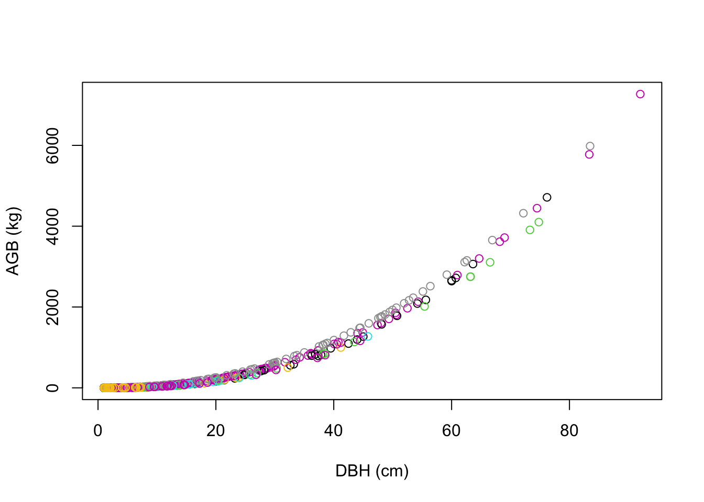
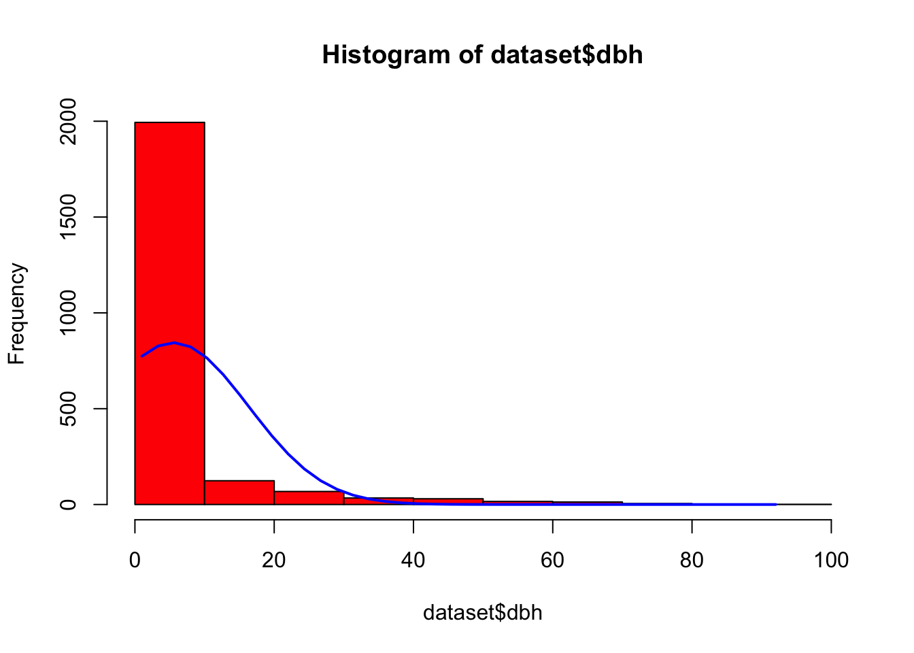
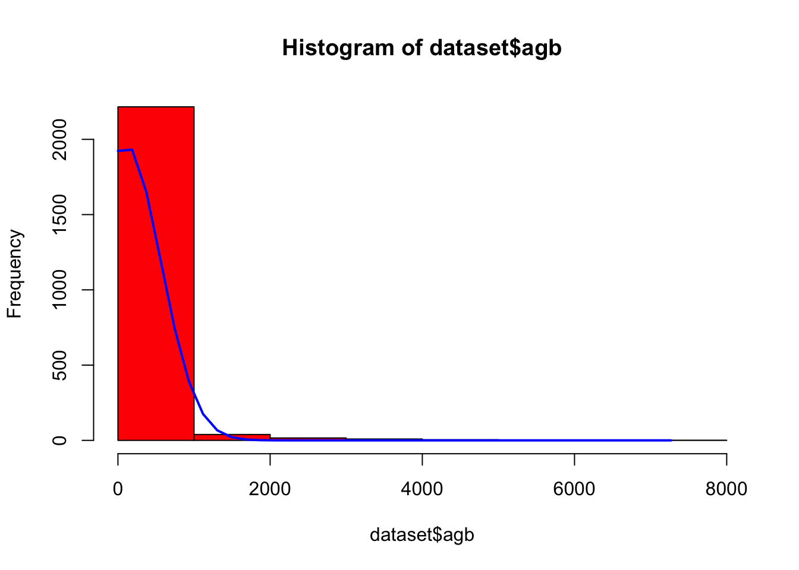

## Introduction

::: {.cell layout-ncols="5"}
:::

The ART-TREES Standard V2.01 mandates precise methodologies for calculating and reporting uncertainty estimates associated with emission factors and activity data within jurisdictional and nested REDD+ projects. In response to these requirements, the LEAF-TA program has commissioned the Guyana ART-TREES project team to develop and support capacity building in specific technical areas.

-   Develop Monte Carlo simulation pathways to quantify uncertainty in emission factors and activity data, ensuring consistency with ART-TREES’s emphasis on robust uncertainty analysis and corrective bias assessment.
-   Use R or other software to create systems that streamline data workflows and enhance accessibility for MRV purposes. Monte Carlo Simulation for Uncertainty Estimation
-   Document methodologies and provide results in formats compliant with ART-TREES reporting standards.
-   Prepare technical reports that detail uncertainty estimation methods and database management workflows.

<!-- -->

-   Develop and deliver training materials to strengthen stakeholder capacity to use ART-TREES-aligned tools and methodologies.

### ART Requirements for Monte Carlo Methods

To reduce risk of over-crediting, the TREES 2.0 Standard (August 2021) [@artREDDEnvironmentalExcellence2021] outlines requirements for reporting uncertainty in emissions and removals, and adjusting estimates where uncertainty levels exceed the defined threshold of a half-width of a 90% confidence interval between the upper and lower bounds (Relative RMSE ≤ 10%). Monte Carlo simulations are identified as an appropriate methodology due to their capacity to model variance and provide conservative estimates from large-scale higly-variable datasets. Specifically, "Monte Carlo simulations shall use the 90% confidence interval and a simulation n of 10,000" (p.45).

**Aggregation of Uncertainty Across Crediting Periods**\
The TREES Standard provides a level of flexibility in allowing participants to aggregate uncertainty deductions across multiple crediting periods. At the end of each crediting period, participants may calculate a consolidated uncertainty deduction based on the summed gross emissions reductions and removals achieved over their entire ART participation. If prior uncertainty deductions exceeded the aggregated deduction sum for the total period, the over-deducted credits will be issued into the participant’s registry account. This approach aims to incentivize participants to refine data quality and uncertainty estimates.

**Exemption for Allometric Estimates**\
An exemption from requirements for Monte Carlo simulations is granted to allometric modeled estimates. The TREES Standards V2.0 states that "such errors are considered consistent between emissions in the crediting level and crediting periods" which therefore do not materially influence the net results.

**Inclusion of Biomass Map Uncertainty**\
Conversely, uncertainty must be assessed and reported for emissions factors derived from biomass maps, as these datasets directly impact the accuracy of emission estimates. TREES participants are encouraged to adopt best practices, such as those outlined in the CEOS LPV Biomass Protocol 2021, to enhance calibration, validation, and reliability of spatially explicit datasets. In this guidance document, key recommendations for good practices include appropriate scaling, temporally & spatially consistent reference data and remote sensing, and the use of approved error metrics (90% CI or RMSE). In particular, three likely sources of uncertainty in biomass estimation are highlighted separately for consideration in assessing and calibrating predictions [@duncansonAbovegroundWoodyBiomass2021].

-   Measurement Uncertainty in tree measurements (i.e DBH and height).
-   Allometric Model Errors in statistically inferring biomass from from tree measurements
-   Sampling & Spatial Uncertainty arising from autocorrelation & over-fitting

**Calculating Uncertainty Deductions**\
Cited on page 46 of the TREES Standards V2.0, calculations of uncertainty deductions are derived using the following formulae:

$$
UNC_t = (GHG ER_t + GHG REMV_t) \times UA_t \text{.            EQ 10}
$$

|  |  |
|--------------------------|----------------------------------------------|
| $UNC_t$ | Uncertainty deduction for year $t$ ($tCO_2e$) |
| $GHG ER_t$ | Gross greenhouse gas emissions reductions for year $t$ ($tCO_2e$) |
| $GHG REMV_t$ | Gross greenhouse gas removals for year $t$ ($tCO_2e$) |
| $UA_t$ | The uncertainty adjustment factor for year $t$ |

: Table 1: Parameters used in Equation 10

The uncertainty adjustment factor ($UAdj_t$) quantifies the proportional adjustment to emissions reductions and removals based on statistical uncertainty. It is defined as:

$$
UAdj_t = 0.524417 \times \frac{HW_{90\%t}}{1.645006}    \text{.                           EQ 11}
$$

|  |  |
|--------------------------|----------------------------------------------|
| $90\%\text{ C I}_{t}$ | The half-width of 90% confidence interval as percentage of mean |
| $1.645006$ | $t$ value for a 90% confidence interval |
| $0.524417$ | A scaling constant to adjust the proportion. |

: Table 2: Parameters used in Equation 11

### Current Methods

In Appendix I, annotated results are presented from a rapid literature review of current methodologies and discussions of Monte Carlo simulations of biomass estimations used in REDD+ studies and programs. The search was conducted using keywords including "Monte Carlo simulations," "biomass estimation," "carbon stock uncertainty," and "REDD+ projects". Variants and combinations of these terms, including "forest carbon accounting" and "allometric uncertainty," were also explored. Data sources were visited among Scopus, Web of Science, and Google Scholar,and specialized journals in forestry, remote sensing, and carbon management. The temporal window of the review focused on studies published in the last two decades (2003–2023), reflecting the period during which Monte Carlo methods gained prominence in forest biomass estimation and REDD+ research evolved into a critical global framework. Additional attention was given to high-impact reviews and meta-analyses that provide state-of-the-art evaluations of the field.

Summarize review here...

#### Current tools

-   Details of the design and parameters of the existing excel tool are available [here](https://www.artredd.org/wp-content/uploads/2021/12/MC-4-estimating-ER-from-forests-update-1-1.xlsx) and [here](https://winrock.org/wp-content/uploads/2018/02/UncertaintyReport-12.26.17.pdf?utm_source=chatgpt.com).

#### Current limitations

-   

<div>

</div>

<div>

</div>

<div>

</div>

### Demonstration script {#sec-1.1}

#### *Environment setup*

::: cell
``` {.r .cell-code}
easypackages::packages(
  "animation", "BIOMASS", "caret", "dataMaid", "DescTools", "dplyr",
  "extrafont", "FawR", "ForestToolsRS", "ggplot2", "htmltools",
  "janitor", "jsonlite", "lattice", "kableExtra", "kernlab",
  "knitr", "Mlmetrics", "olsrr", "plotly", "psych", "RColorBrewer",
  "rmarkdown", "readxl", "solarizeddox", "tibble", "tidymodels", "tidyverse",
  "tinytex", "tune", "useful", "webshot", "webshot2",
  prompt = F
  )
```
:::

### Import data

This section outlines the tools for importing and preparing forestry and biomass data for analysis, a key step in building ART-TREES-compliant MRV systems. Using the `allodb` package, we load a global allometry database and a dummy dataset from the Smithsonian Institute ForestGEO project.

:::::::: cell
``` {.r .cell-code}
library("allodb") # https://docs.ropensci.org/allodb/
set.seed(333)
#data(ufc) # spuRs::vol.m3(dataset$dbh.cm, dataset$height.m, multiplier = 0.5)
data(scbi_stem1)
dataset = scbi_stem1
head(dataset) |> tibble::as_tibble()
```

:::: cell-output-display
::: kable-table
| treeID | stemID |  dbh | genus | species | Family      |
|-------:|-------:|-----:|:------|:--------|:------------|
|   2695 |   2695 | 1.41 | Acer  | negundo | Sapindaceae |
|   1229 |  38557 | 1.67 | Acer  | negundo | Sapindaceae |
|   1230 |   1230 | 1.42 | Acer  | negundo | Sapindaceae |
|   1295 |  32303 | 1.04 | Acer  | negundo | Sapindaceae |
|   1229 |  32273 | 2.47 | Acer  | negundo | Sapindaceae |
|     66 |  31258 | 2.19 | Acer  | negundo | Sapindaceae |
:::
::::

``` {.r .cell-code}
psych::describe(dataset)
```

:::: cell-output-display
::: kable-table
|   | vars | n | mean | sd | median | trimmed | mad | min | max | range | skew | kurtosis | se |
|:----|----:|----:|----:|----:|----:|----:|----:|----:|----:|----:|----:|----:|----:|
| treeID | 1 | 2287 | 2778.658067 | 1929.262548 | 2525.00 | 2705.540688 | 2091.9486000 | 1 | 6207.00 | 6206.00 | 0.2717859 | -1.1051173 | 40.3420768 |
| stemID | 2 | 2287 | 16577.120682 | 16197.884045 | 5022.00 | 15661.273621 | 5749.5228000 | 1 | 40180.00 | 40179.00 | 0.3961204 | -1.7487292 | 338.7078042 |
| dbh | 3 | 2287 | 5.520162 | 10.803608 | 1.67 | 2.653741 | 0.7857782 | 1 | 92.02 | 91.02 | 3.8111843 | 16.3042875 | 0.2259101 |
| genus\* | 4 | 2287 | 16.372540 | 6.516571 | 18.00 | 16.712725 | 0.0000000 | 1 | 31.00 | 30.00 | -0.5713109 | 0.1413179 | 0.1362655 |
| species\* | 5 | 2287 | 13.256231 | 9.600139 | 8.00 | 11.305298 | 0.0000000 | 1 | 40.00 | 39.00 | 1.5869799 | 1.2976632 | 0.2007449 |
| Family\* | 6 | 2287 | 13.068212 | 4.021778 | 13.00 | 13.334244 | 0.0000000 | 1 | 22.00 | 21.00 | -0.5763674 | 1.4407792 | 0.0840979 |
:::
::::

``` {.r .cell-code}
str(dataset)
```

::: {.cell-output .cell-output-stdout}
```         
tibble [2,287 × 6] (S3: tbl_df/tbl/data.frame)
 $ treeID : int [1:2287] 2695 1229 1230 1295 1229 66 2600 4936 1229 1005 ...
 $ stemID : int [1:2287] 2695 38557 1230 32303 32273 31258 2600 4936 36996 1005 ...
 $ dbh    : num [1:2287] 1.41 1.67 1.42 1.04 2.47 ...
 $ genus  : chr [1:2287] "Acer" "Acer" "Acer" "Acer" ...
 $ species: chr [1:2287] "negundo" "negundo" "negundo" "negundo" ...
 $ Family : chr [1:2287] "Sapindaceae" "Sapindaceae" "Sapindaceae" "Sapindaceae" ...
```
:::
::::::::

Tables 1-3: Smithsonian Institute GEOForest dataset from `allodb` package (n = 2287)

### Probability density functions

Accurate selection of probability density functions (PDFs) is essential for modeling uncertainties in carbon stocks and activity data. This section describes methodologies for fitting PDFs to data, ensuring results are robust and aligned with ART-TREES best practices.

-   Use of statistical tests for goodness-of-fit validation.

-   Integration of domain expertise to refine parameter selection.

:::::::::: cell
``` {.r .cell-code}
# add allometry database
data(equations)
data("equations_metadata")
show_cols   = c("equation_id", "equation_taxa", "equation_allometry")
eq_tab_acer = new_equations(subset_taxa = "Acer")
head(eq_tab_acer[, show_cols])
```

:::: cell-output-display
::: kable-table
| equation_id | equation_taxa | equation_allometry |
|:-----------------|:-----------------|:------------------------------------|
| a4e4d1 | Acer saccharum | exp(-2.192-0.011*dbh+2.67*(log(dbh))) |
| dfc2c7 | Acer rubrum | 2.02338\*(dbh^2)^1.27612 |
| eac63e | Acer rubrum | 5.2879\*(dbh^2)^1.07581 |
| f49bcb | Acer pseudoplatanus | exp(-5.644074+(2.5189*(log(pi*dbh)))) |
| 14bf3d | Acer mandshuricum | 0.0335\*(dbh)^1.606+0.0026*(dbh)\^3.323+0.1222*(dbh)^2.310 |
| 0c7cd6 | Acer mono | 0.0202\*(dbh)^1.810+0.0111*(dbh)\^2.740+0.1156*(dbh)^2.336 |
:::
::::

``` {.r .cell-code}
# Compute above ground biomass
dataset$agb = allodb::get_biomass(
    dbh     = dataset$dbh,
    genus   = dataset$genus,
    species = dataset$species,
    coords  = c(-78.2, 38.9)
  )

# examine dbh ~ agb function
dbh_agb = lm(dbh ~ agb, data = dataset)
#olsrr::ols_test_breusch_pagan(lm(dbh_agb)) #<0.0000
#h = lattice::histogram(dbh ~ agb, data = dataset)
plot(
  x    = dataset$dbh,
  y    = dataset$agb,
  col  = factor(scbi_stem1$genus),
  xlab = "DBH (cm)",
  ylab = "AGB (kg)"
)

# examine univariate distributions
h1 = hist(dataset$dbh, breaks=10, col="red")
xfit<-seq(min(dataset$dbh),max(dataset$dbh),length=40)
yfit<-dnorm(xfit,mean=mean(dataset$dbh),sd=sd(dataset$dbh))
yfit <- yfit*diff(h1$mids[1:2])*length(dataset$dbh)
lines(xfit, yfit, col="blue", lwd=2)

h2 = hist(dataset$agb, breaks=10, col="red")
xfit<-seq(min(dataset$agb),max(dataset$agb),length=40)
yfit<-dnorm(xfit,mean=mean(dataset$agb),sd=sd(dataset$agb))
yfit <- yfit*diff(h2$mids[1:2])*length(dataset$agb)
lines(xfit, yfit, col="blue", lwd=2)
wilcox.test(dataset$dbh) # p<0.00001
```

::: {.cell-output .cell-output-stdout}
```         

    Wilcoxon signed rank test with continuity correction

data:  dataset$dbh
V = 2616328, p-value < 2.2e-16
alternative hypothesis: true location is not equal to 0
```
:::

``` {.r .cell-code}
wilcox.test(dataset$agb) # p<0.00001
```

::: {.cell-output .cell-output-stdout}
```         

    Wilcoxon signed rank test with continuity correction

data:  dataset$agb
V = 2616328, p-value < 2.2e-16
alternative hypothesis: true location is not equal to 0
```
:::

::: cell-output-display
{width="33%"}
:::

::: cell-output-display
{width="33%"}
:::

::: cell-output-display
{width="33%"}
:::
::::::::::

### Simulation Regime

This section introduces the design of the Monte Carlo simulation regime, including:

-   Simulation parameters are defined to balance computational efficiency and statistical robustness.

-   Cross-validation techniques are employed to evaluate model performance and identify bias or variance.

The `LGOCV` acronym used in the `caret` package functions below stands for "leave one group out cross validation". We must select the % of test data that is set out from the build upon which the model will be repeatedly trained. Note, the following code applies functions to full dataset without explicit training-test split. **Questions remains on whether we require cross-validation uncertainty estimate to review internal bias, and whether we would like to develop Monte Carlo tools for spatial uncertainty used in Activity Data analysis**. For your consideration, the consultant has previously developed Monte Carlo tools for LULC applications, saved [here](https://github.com/seamusrobertmurphy/02-lulc-classification)

:::: cell
``` {.r .cell-code}
# Cross-validation split for bias detection
#samples     = caret::createDataPartition(dataset_tidy$volume, p = 0.80, list = FALSE)
#train_data  = dataset_tidy[samples, ]
#test_data   = dataset_tidy[-samples, ]

# Simulation pattern & regime
monte_carlo = trainControl(
  method    = "LGOCV",
  number    = 10,     # number of simulations
  p         = 0.8)     # percentage resampled


# Training model fit with all covariates (".") & the simulation
lm_monte_carlo = train(
  data      = dataset, 
  agb ~ ., 
  na.action = na.omit,
  trControl = monte_carlo)

lm_monte_carlo 
```

::: {.cell-output .cell-output-stdout}
```         
Random Forest 

2287 samples
   6 predictor

No pre-processing
Resampling: Repeated Train/Test Splits Estimated (10 reps, 80%) 
Summary of sample sizes: 1832, 1832, 1832, 1832, 1832, 1832, ... 
Resampling results across tuning parameters:

  mtry  RMSE       Rsquared   MAE       
   2    334.91964  0.5977225  114.373822
  47     83.37237  0.9711580   14.009351
  93     49.98649  0.9895214    8.593528

RMSE was used to select the optimal model using the smallest value.
The final value used for the model was mtry = 93.
```
:::
::::

### Plot residuals

To enable access to these predictions, we need to instruct `caret` to retain the resampled predictions by setting `savePredictions = "final"` in our `trainControl()` function. It's important to be aware that if you’re working with a large dataset or numerous resampling iterations, the resulting `train()` object may grow significantly in size. This happens because `caret` must store a record of every row, including both the observed values and predictions, for each resampling iteration. By visualizing the results, we can offer insights into the performance of our model on the resampled data.

:::::: cell
``` {.r .cell-code}
monte_carlo_viz = trainControl(
  method    = "LGOCV", 
  p         = 0.8,            
  number    = 1,  # just for saving previous results
  savePredictions = "final") 

lm_monte_carlo_viz = train(
  agb ~ ., 
  data      = dataset, 
  method    = "lm",
  na.action = na.omit,
  trControl = monte_carlo_viz)

head(lm_monte_carlo_viz$pred)  # residuals 
```

:::: cell-output-display
::: kable-table
| intercept |        pred |          obs | rowIndex | Resample  |
|:----------|------------:|-------------:|---------:|:----------|
| TRUE      |  -39.259595 |    0.2822055 |        2 | Resample1 |
| TRUE      |   -8.616432 |    0.7664882 |        5 | Resample1 |
| TRUE      |  -31.913620 |    0.5637806 |        6 | Resample1 |
| TRUE      |  -97.233363 |    0.1832042 |       10 | Resample1 |
| TRUE      |  356.407185 |  161.5561844 |       20 | Resample1 |
| TRUE      | 1393.945330 | 1095.2695394 |       22 | Resample1 |
:::
::::

``` {.r .cell-code}
lm_monte_carlo_viz$pred |> 
  ggplot(aes(x=pred,y=obs)) +
    geom_point(shape=1) + 
    geom_abline(slope=1, colour='blue')  +
    coord_obs_pred()
```

::: cell-output-display
{width="672"}
:::
::::::

### Uncertainty Estimates

This section discusses the trade-offs and methodological choices in uncertainty estimation using Monte Carlo simulations. It aligns with ART-TREES principles by:

-   Quantifying confidence intervals for emissions estimates.

-   Addressing potential biases in the modeling process.

-   Ensuring robustness in uncertainty reporting.

***Working Notes...***

References to key studies on cross-validation methods provide a theoretical foundation for the approach.**Monte Carlo cross-validation** (MCCV) involves randomly dividing the dataset into two parts: a training subset and a validation subset, without reusing data points. The model is trained on the training subset, denoted as ( n_t ), and assessed on the validation subset, ( n_v ). While there are ( \binom{N}{n_t} ) distinct ways to form the training subsets, MCCV bypasses the computational burden of evaluating all these combinations by sampling a smaller number of iterations. Zhang (1993) demonstrated that performing MCCV for ( N ) iterations yields results comparable to exhaustive cross-validation over all possible subsets. However, studies investigating MCCV for large dataset sizes (( N )) remain limited.

The trade-off between bias and variance in MCCV is influenced by the choice of ( k ) (iterations) and ( n_t ) (training subset size). Increasing ( k ) or ( n_t ) tends to reduce bias but increases variance. Larger training subsets lead to greater similarity across iterations, which can result in overfitting to the training data. The bias-variance characteristics of ( k )-fold cross-validation (kFCV) and MCCV differ, but their bias levels can be aligned by selecting appropriate values for ( k ) and ( n_t ). A detailed comparison of the bias and variance for both approaches can be found in Burnam (1989), where MCCV is referred to as the "repeated-learning testing-model."

Monte Carlo Simulation in LULC Classification of Activity Data Assessment:

::: cell
``` {.r .cell-code}
library(ForesToolboxRS)
dir.create("./data/testdata")
download.file("https://github.com/ytarazona/ft_data/raw/main/data/LC08_232066_20190727_SR.zip",destfile = "testdata/LC08_232066_20190727_SR.zip")
unzip("testdata/LC08_232066_20190727_SR.zip", exdir = "testdata") download.file("https://github.com/ytarazona/ft_data/raw/main/data/signatures.zip", destfile = "testdata/signatures.zip")
unzip("testdata/signatures.zip", exdir = "testdata")

image <- stack("./data/testdata/LC08_232066_20190727_SR.tif")
sig <- read_sf("./data/testdata/signatures.shp")
classRF <- mla(img = image, model = "randomForest", endm = sig, training_split = 80)
print(classRF)
```
:::

::: cell
``` {.r .cell-code}
# Classification
colmap <- c("#0000FF","#228B22","#FF1493", "#00FF00")
plot(classRF$Classification, main = "RandomForest Classification", col = colmap, axes = TRUE)
```
:::


{width="672"}

::: cell
``` {.r .cell-code}
plot(
  cal_ml$svm_mccv,
  main = "Monte Carlo Cross-Validation calibration",
  col = "darkmagenta",
  type = "b",
  ylim = c(0, 0.4),
  ylab = "Error between 0 and 1",
  xlab = "Number of iterations"
)
lines(cal_ml$randomForest_mccv, col = "red", type = "b")
lines(cal_ml$naiveBayes_mccv, col = "green", type = "b")
lines(cal_ml$knn_mccv, col = "blue", type = "b")
legend(
  "topleft",
  c(
    "Support Vector Machine",
    "Random Forest",
    "Naive Bayes",
    "K-nearest Neighbors"
  ),
  col = c("darkmagenta", "red", "green", "blue"),
  lty = 1,
  cex = 0.7
)
```
:::


------------------------------------------------------------------------

Burman, P. (1989). A comparative study of ordinary cross-validation, ( v )-fold cross-validation, and the repeated learning testing-model methods. *Biometrika*, **76**, 503–514.

Hastie, T., Tibshirani, R., & Friedman, J. (2011). *The Elements of Statistical Learning: Data Mining, Inference, and Prediction*. 2nd ed. New York: Springer.

Zhang, P. (1993). Model selection via multifold cross-validation. *Annals of Statistics*, **21**, 299–313.

### Runtime snapshot

:::::: cell
``` {.r .cell-code}
devtools::session_info()
```

::: {.cell-output .cell-output-stdout}
```         
─ Session info ───────────────────────────────────────────────────────────────
 setting  value
 version  R version 4.4.2 (2024-10-31)
 os       Fedora Linux 40 (Workstation Edition)
 system   x86_64, linux-gnu
 ui       X11
 language (EN)
 collate  en_CA.UTF-8
 ctype    en_CA.UTF-8
 tz       America/Vancouver
 date     2024-12-20
 pandoc   3.1.3 @ /usr/libexec/rstudio/bin/pandoc/ (via rmarkdown)

─ Packages ───────────────────────────────────────────────────────────────────
 package      * version    date (UTC) lib source
 abind          1.4-8      2024-09-12 [2] CRAN (R 4.4.1)
 allodb       * 0.0.1.9000 2024-12-19 [1] Github (ropensci/allodb@4207f86)
 animation    * 2.7        2021-10-07 [2] CRAN (R 4.4.0)
 assertthat     0.2.1      2019-03-21 [2] CRAN (R 4.4.0)
 backports      1.5.0      2024-05-23 [2] CRAN (R 4.4.0)
 BIOMASS      * 2.1.11     2023-09-29 [2] CRAN (R 4.4.0)
 boot           1.3-31     2024-08-28 [2] CRAN (R 4.4.1)
 broom        * 1.0.7      2024-09-26 [2] CRAN (R 4.4.1)
 cachem         1.1.0      2024-05-16 [2] CRAN (R 4.4.0)
 car            3.1-3      2024-09-27 [2] CRAN (R 4.4.1)
 carData        3.0-5      2022-01-06 [2] CRAN (R 4.4.0)
 caret        * 7.0-1      2024-12-10 [2] CRAN (R 4.4.2)
 cellranger     1.1.0      2016-07-27 [2] CRAN (R 4.4.0)
 chromote       0.3.1      2024-08-30 [2] CRAN (R 4.4.1)
 class          7.3-22     2023-05-03 [2] CRAN (R 4.4.0)
 classInt       0.4-10     2023-09-05 [2] CRAN (R 4.4.0)
 cli            3.6.3      2024-06-21 [2] CRAN (R 4.4.0)
 codetools      0.2-20     2024-03-31 [2] CRAN (R 4.4.0)
 colorspace     2.1-1      2024-07-26 [2] CRAN (R 4.4.1)
 CoprManager    0.5.7      2024-10-31 [4] local
 data.table     1.16.4     2024-12-06 [2] CRAN (R 4.4.2)
 dataMaid     * 1.4.1      2021-10-08 [2] CRAN (R 4.4.1)
 DBI            1.2.3      2024-06-02 [2] CRAN (R 4.4.0)
 DEoptimR       1.1-3-1    2024-11-23 [2] CRAN (R 4.4.2)
 DescTools    * 0.99.58    2024-11-08 [2] CRAN (R 4.4.1)
 devtools       2.4.5      2022-10-11 [2] CRAN (R 4.4.0)
 dials        * 1.3.0      2024-07-30 [2] CRAN (R 4.4.1)
 DiceDesign     1.10       2023-12-07 [2] CRAN (R 4.4.0)
 digest         0.6.37     2024-08-19 [2] CRAN (R 4.4.1)
 dplyr        * 1.1.4      2023-11-17 [2] CRAN (R 4.4.0)
 e1071          1.7-16     2024-09-16 [2] CRAN (R 4.4.1)
 easypackages   0.1.0      2016-12-05 [2] CRAN (R 4.4.0)
 ellipsis       0.3.2      2021-04-29 [2] CRAN (R 4.4.0)
 evaluate       1.0.1      2024-10-10 [2] CRAN (R 4.4.1)
 Exact          3.3        2024-07-21 [2] CRAN (R 4.4.1)
 expm           1.0-0      2024-08-19 [2] CRAN (R 4.4.1)
 extrafont    * 0.19       2023-01-18 [2] CRAN (R 4.4.0)
 extrafontdb    1.0        2012-06-11 [2] CRAN (R 4.4.0)
 farver         2.1.2      2024-05-13 [2] CRAN (R 4.4.0)
 fastmap        1.2.0      2024-05-15 [2] CRAN (R 4.4.0)
 forcats      * 1.0.0      2023-01-29 [2] CRAN (R 4.4.0)
 foreach        1.5.2      2022-02-02 [2] CRAN (R 4.4.0)
 Formula        1.2-5      2023-02-24 [2] CRAN (R 4.4.0)
 fs             1.6.5      2024-10-30 [2] CRAN (R 4.4.1)
 furrr          0.3.1      2022-08-15 [2] CRAN (R 4.4.0)
 future         1.34.0     2024-07-29 [2] CRAN (R 4.4.1)
 future.apply   1.11.3     2024-10-27 [2] CRAN (R 4.4.1)
 generics       0.1.3      2022-07-05 [2] CRAN (R 4.4.0)
 ggplot2      * 3.5.1      2024-04-23 [2] CRAN (R 4.4.0)
 gld            2.6.6      2022-10-23 [2] CRAN (R 4.4.0)
 globals        0.16.3     2024-03-08 [2] CRAN (R 4.4.0)
 glue           1.8.0      2024-09-30 [2] CRAN (R 4.4.1)
 goftest        1.2-3      2021-10-07 [2] CRAN (R 4.4.0)
 gower          1.0.2      2024-12-17 [2] CRAN (R 4.4.2)
 GPfit          1.0-8      2019-02-08 [2] CRAN (R 4.4.0)
 gridExtra      2.3        2017-09-09 [2] CRAN (R 4.4.0)
 gtable         0.3.6      2024-10-25 [2] CRAN (R 4.4.1)
 hardhat        1.4.0      2024-06-02 [2] CRAN (R 4.4.0)
 haven          2.5.4      2023-11-30 [2] CRAN (R 4.4.0)
 hms            1.1.3      2023-03-21 [2] CRAN (R 4.4.0)
 htmltools    * 0.5.8.1    2024-04-04 [2] CRAN (R 4.4.0)
 htmlwidgets    1.6.4      2023-12-06 [2] CRAN (R 4.4.0)
 httpuv         1.6.15     2024-03-26 [2] CRAN (R 4.4.0)
 httr           1.4.7      2023-08-15 [2] CRAN (R 4.4.0)
 infer        * 1.0.7      2024-03-25 [2] CRAN (R 4.4.0)
 ipred          0.9-15     2024-07-18 [2] CRAN (R 4.4.1)
 iterators      1.0.14     2022-02-05 [2] CRAN (R 4.4.0)
 janitor      * 2.2.0      2023-02-02 [2] CRAN (R 4.4.0)
 jsonlite     * 1.8.9      2024-09-20 [2] CRAN (R 4.4.1)
 kableExtra   * 1.4.0      2024-01-24 [2] CRAN (R 4.4.0)
 kernlab      * 0.9-33     2024-08-13 [2] CRAN (R 4.4.1)
 KernSmooth     2.23-24    2024-05-17 [2] CRAN (R 4.4.0)
 knitr        * 1.49       2024-11-08 [2] CRAN (R 4.4.1)
 labeling       0.4.3      2023-08-29 [2] CRAN (R 4.4.0)
 later          1.4.1      2024-11-27 [2] CRAN (R 4.4.2)
 lattice      * 0.22-6     2024-03-20 [2] CRAN (R 4.4.0)
 lava           1.8.0      2024-03-05 [2] CRAN (R 4.4.0)
 lazyeval       0.2.2      2019-03-15 [2] CRAN (R 4.4.0)
 lhs            1.2.0      2024-06-30 [2] CRAN (R 4.4.1)
 lifecycle      1.0.4      2023-11-07 [2] CRAN (R 4.4.0)
 listenv        0.9.1      2024-01-29 [2] CRAN (R 4.4.0)
 lmom           3.2        2024-09-30 [2] CRAN (R 4.4.1)
 lubridate    * 1.9.4      2024-12-08 [2] CRAN (R 4.4.2)
 magrittr       2.0.3      2022-03-30 [2] CRAN (R 4.4.0)
 MASS           7.3-61     2024-06-13 [2] CRAN (R 4.4.0)
 Matrix         1.7-1      2024-10-18 [2] CRAN (R 4.4.1)
 memoise        2.0.1      2021-11-26 [2] CRAN (R 4.4.0)
 mime           0.12       2021-09-28 [2] CRAN (R 4.4.0)
 miniUI         0.1.1.1    2018-05-18 [2] CRAN (R 4.4.0)
 minpack.lm     1.2-4      2023-09-11 [2] CRAN (R 4.4.0)
 mnormt         2.1.1      2022-09-26 [2] CRAN (R 4.4.0)
 modeldata    * 1.4.0      2024-06-19 [2] CRAN (R 4.4.0)
 ModelMetrics   1.2.2.2    2020-03-17 [2] CRAN (R 4.4.0)
 munsell        0.5.1      2024-04-01 [2] CRAN (R 4.4.0)
 mvtnorm        1.3-2      2024-11-04 [2] CRAN (R 4.4.1)
 nlme           3.1-166    2024-08-14 [2] CRAN (R 4.4.1)
 nnet           7.3-19     2023-05-03 [2] CRAN (R 4.4.0)
 nortest        1.0-4      2015-07-30 [2] CRAN (R 4.4.0)
 olsrr        * 0.6.1      2024-11-06 [2] CRAN (R 4.4.1)
 pander         0.6.5      2022-03-18 [2] CRAN (R 4.4.0)
 parallelly     1.41.0     2024-12-18 [2] CRAN (R 4.4.2)
 parsnip      * 1.2.1      2024-03-22 [2] CRAN (R 4.4.0)
 pillar         1.10.0     2024-12-17 [2] CRAN (R 4.4.2)
 pkgbuild       1.4.5      2024-10-28 [2] CRAN (R 4.4.1)
 pkgconfig      2.0.3      2019-09-22 [2] CRAN (R 4.4.0)
 pkgload        1.4.0      2024-06-28 [2] CRAN (R 4.4.1)
 plotly       * 4.10.4     2024-01-13 [2] CRAN (R 4.4.0)
 plyr           1.8.9      2023-10-02 [2] CRAN (R 4.4.0)
 pROC           1.18.5     2023-11-01 [2] CRAN (R 4.4.0)
 processx       3.8.4      2024-03-16 [2] CRAN (R 4.4.0)
 prodlim        2024.06.25 2024-06-24 [2] CRAN (R 4.4.0)
 profvis        0.4.0      2024-09-20 [2] CRAN (R 4.4.1)
 promises       1.3.2      2024-11-28 [2] CRAN (R 4.4.2)
 proxy          0.4-27     2022-06-09 [2] CRAN (R 4.4.0)
 ps             1.8.1      2024-10-28 [2] CRAN (R 4.4.1)
 psych        * 2.4.6.26   2024-06-27 [2] CRAN (R 4.4.1)
 purrr        * 1.0.2      2023-08-10 [2] CRAN (R 4.4.0)
 R6             2.5.1      2021-08-19 [2] CRAN (R 4.4.0)
 randomForest   4.7-1.2    2024-09-22 [2] CRAN (R 4.4.1)
 rappdirs       0.3.3      2021-01-31 [2] CRAN (R 4.4.1)
 RColorBrewer * 1.1-3      2022-04-03 [2] CRAN (R 4.4.0)
 Rcpp           1.0.13-1   2024-11-02 [2] CRAN (R 4.4.1)
 readr        * 2.1.5      2024-01-10 [2] CRAN (R 4.4.0)
 readxl       * 1.4.3      2023-07-06 [2] CRAN (R 4.4.0)
 recipes      * 1.1.0      2024-07-04 [2] CRAN (R 4.4.1)
 remotes        2.5.0      2024-03-17 [2] CRAN (R 4.4.0)
 reshape2       1.4.4      2020-04-09 [2] CRAN (R 4.4.0)
 rlang          1.1.4      2024-06-04 [2] CRAN (R 4.4.0)
 rmarkdown    * 2.29       2024-11-04 [1] CRAN (R 4.4.2)
 robustbase     0.99-4-1   2024-09-27 [2] CRAN (R 4.4.1)
 rootSolve      1.8.2.4    2023-09-21 [2] CRAN (R 4.4.0)
 rpart          4.1.23     2023-12-05 [2] CRAN (R 4.4.0)
 rsample      * 1.2.1      2024-03-25 [2] CRAN (R 4.4.0)
 rstudioapi     0.17.1     2024-10-22 [2] CRAN (R 4.4.1)
 Rttf2pt1       1.3.12     2023-01-22 [2] CRAN (R 4.4.0)
 scales       * 1.3.0      2023-11-28 [2] CRAN (R 4.4.0)
 sessioninfo    1.2.2      2021-12-06 [2] CRAN (R 4.4.0)
 sf             1.0-19     2024-11-05 [2] CRAN (R 4.4.2)
 shiny          1.10.0     2024-12-14 [2] CRAN (R 4.4.2)
 snakecase      0.11.1     2023-08-27 [2] CRAN (R 4.4.0)
 stringi        1.8.4      2024-05-06 [2] CRAN (R 4.4.0)
 stringr      * 1.5.1      2023-11-14 [2] CRAN (R 4.4.0)
 survival       3.8-3      2024-12-17 [2] CRAN (R 4.4.2)
 svglite        2.1.3      2023-12-08 [2] CRAN (R 4.4.0)
 systemfonts    1.1.0      2024-05-15 [2] CRAN (R 4.4.0)
 terra          1.8-5      2024-12-12 [2] CRAN (R 4.4.2)
 tibble       * 3.2.1      2023-03-20 [2] CRAN (R 4.4.0)
 tidymodels   * 1.2.0      2024-03-25 [2] CRAN (R 4.4.0)
 tidyr        * 1.3.1      2024-01-24 [2] CRAN (R 4.4.0)
 tidyselect     1.2.1      2024-03-11 [2] CRAN (R 4.4.0)
 tidyverse    * 2.0.0      2023-02-22 [2] CRAN (R 4.4.0)
 timechange     0.3.0      2024-01-18 [2] CRAN (R 4.4.1)
 timeDate       4041.110   2024-09-22 [2] CRAN (R 4.4.1)
 tinytex      * 0.54       2024-11-01 [2] CRAN (R 4.4.1)
 tune         * 1.2.1      2024-04-18 [2] CRAN (R 4.4.0)
 tzdb           0.4.0      2023-05-12 [2] CRAN (R 4.4.0)
 units          0.8-5      2023-11-28 [2] CRAN (R 4.4.0)
 urlchecker     1.0.1      2021-11-30 [2] CRAN (R 4.4.0)
 useful       * 1.2.6.1    2023-10-24 [2] CRAN (R 4.4.0)
 usethis        3.1.0      2024-11-26 [2] CRAN (R 4.4.2)
 vctrs          0.6.5      2023-12-01 [2] CRAN (R 4.4.0)
 viridisLite    0.4.2      2023-05-02 [2] CRAN (R 4.4.0)
 webshot      * 0.5.5      2023-06-26 [2] CRAN (R 4.4.0)
 webshot2     * 0.1.1      2023-08-11 [2] CRAN (R 4.4.0)
 websocket      1.4.2      2024-07-22 [2] CRAN (R 4.4.1)
 withr          3.0.2      2024-10-28 [2] CRAN (R 4.4.1)
 workflows    * 1.1.4      2024-02-19 [2] CRAN (R 4.4.0)
 workflowsets * 1.1.0      2024-03-21 [2] CRAN (R 4.4.0)
 xfun           0.49       2024-10-31 [2] CRAN (R 4.4.1)
 xml2           1.3.6      2023-12-04 [2] CRAN (R 4.4.0)
 xtable         1.8-4      2019-04-21 [2] CRAN (R 4.4.0)
 yaml           2.3.10     2024-07-26 [2] CRAN (R 4.4.1)
 yardstick    * 1.3.1      2024-03-21 [2] CRAN (R 4.4.0)

 [1] /home/seamus/R/x86_64-redhat-linux-gnu-library/4.4
 [2] /usr/local/lib/R/library
 [3] /usr/lib64/R/library
 [4] /usr/share/R/library

──────────────────────────────────────────────────────────────────────────────
```
:::

``` {.r .cell-code}
Sys.getenv()
```

::: {.cell-output .cell-output-stdout}
```         
CHROME_DESKTOP          RStudio.desktop
CLICOLOR_FORCE          1
DBUS_SESSION_BUS_ADDRESS
                        unix:path=/run/user/1000/bus
DEBUGINFOD_IMA_CERT_PATH
                        /etc/keys/ima:
DEBUGINFOD_URLS         https://debuginfod.fedoraproject.org/
DENO_DOM_PLUGIN         /usr/libexec/quarto/bin/tools/x86_64/deno_dom/libplugin.so
DENO_NO_UPDATE_CHECK    1
DENO_TLS_CA_STORE       system,mozilla
DESKTOP_SESSION         gnome
DISPLAY                 :0
EARTHENGINE_ENV         ./
EARTHENGINE_PYTHON      ./bin/python3
EDITOR                  /usr/bin/nano
GDK_BACKEND             x11
GDM_LANG                en_CA.UTF-8
GDMSESSION              gnome
GIO_LAUNCHED_DESKTOP_FILE
                        /usr/share/applications/rstudio.desktop
GIO_LAUNCHED_DESKTOP_FILE_PID
                        4640
GIT_ASKPASS             rpostback-askpass
GJS_DEBUG_OUTPUT        stderr
GJS_DEBUG_TOPICS        JS ERROR;JS LOG
GNOME_SETUP_DISPLAY     :1
HISTCONTROL             ignoredups
HISTSIZE                1000
HOME                    /home/seamus
HOSTNAME                fedora
INVOCATION_ID           514ddca882e040dbbac2b64601013ac4
JOURNAL_STREAM          9:19261
LANG                    en_CA.UTF-8
LD_LIBRARY_PATH         /usr/lib64/R/lib:/usr/lib/jvm/jre/lib/server:/usr/lib64/R/lib:/usr/lib/jvm/jre/lib/server
LESSOPEN                ||/usr/bin/lesspipe.sh %s
LN_S                    ln -s
LOGNAME                 seamus
MAIL                    /var/spool/mail/seamus
MAKE                    make
MANAGERPID              2018
MEMORY_PRESSURE_WATCH   /sys/fs/cgroup/user.slice/user-1000.slice/user@1000.service/session.slice/org.gnome.Shell@wayland.service/memory.pressure
MEMORY_PRESSURE_WRITE   c29tZSAyMDAwMDAgMjAwMDAwMAA=
MOZ_GMP_PATH            /usr/lib64/mozilla/plugins/gmp-gmpopenh264/system-installed
MPLENGINE               tkAgg
NO_AT_BRIDGE            1
ORIGINAL_XDG_CURRENT_DESKTOP
                        GNOME
PAGER                   /usr/bin/less
PATH                    /home/seamus/.local/bin:/home/seamus/bin:/usr/local/bin:/usr/local/sbin:/usr/bin:/usr/sbin:/usr/libexec/quarto/bin:/usr/libexec/rstudio/bin/postback
PKGLOAD_PARENT_TEMPDIR
                        /tmp/RtmpbQzvfY
PWD                     /home/seamus/repos/monte-carlo-trees
PYTHONIOENCODING        utf-8
QT_IM_MODULE            ibus
QUARTO_BIN_PATH         /usr/libexec/quarto/bin
QUARTO_CROSSREF_INDEX_PATH
                        /home/seamus/repos/monte-carlo-trees/.Rproj.user/4BF3B1F2/quarto-crossref/02515D64
QUARTO_DENO             /usr/libexec/quarto/bin/tools/x86_64/deno
QUARTO_DOCUMENT_PATH    .
QUARTO_PROJECT_ROOT     /home/seamus/repos/monte-carlo-trees
QUARTO_RENDER_TOKEN     19fd2bb6-d2ef-446b-8962-c2dfd97e83f2
QUARTO_ROOT             /usr
QUARTO_SHARE_PATH       /usr/libexec/quarto/share
R_ARCH                  
R_BROWSER               /usr/bin/xdg-open
R_BZIPCMD               /usr/bin/bzip2
R_CLI_HAS_HYPERLINK_IDE_HELP
                        true
R_CLI_HAS_HYPERLINK_IDE_RUN
                        true
R_CLI_HAS_HYPERLINK_IDE_VIGNETTE
                        true
R_DOC_DIR               /usr/share/doc/R
R_GZIPCMD               /usr/bin/gzip
R_HOME                  /usr/lib64/R
R_INCLUDE_DIR           /usr/include/R
R_LIBS_SITE             /usr/local/lib/R/site-library:/usr/local/lib/R/library:/usr/lib64/R/library:/usr/share/R/library
R_LIBS_USER             /home/seamus/R/x86_64-redhat-linux-gnu-library/4.4
R_PAPERSIZE             a4
R_PAPERSIZE_USER        a4
R_PDFVIEWER             /usr/bin/xdg-open
R_PLATFORM              x86_64-redhat-linux-gnu
R_PRINTCMD              
R_RD4PDF                times,inconsolata,hyper
R_RUNTIME               
R_SESSION_TMPDIR        /tmp/RtmpbQzvfY
R_SHARE_DIR             /usr/share/R
R_STRIP_SHARED_LIB      strip --strip-unneeded
R_STRIP_STATIC_LIB      strip --strip-debug
R_TEXI2DVICMD           /usr/bin/texi2dvi
R_UNZIPCMD              /usr/bin/unzip
R_ZIPCMD                /usr/bin/zip
RETICULATE_MINICONDA_ENABLED
                        
RMARKDOWN_MATHJAX_PATH
                        /usr/libexec/rstudio/resources/mathjax-27
RS_LOG_LEVEL            WARN
RS_RPOSTBACK_PATH       /usr/libexec/rstudio/bin/rpostback
RS_SHARED_SECRET        f1124332-4e57-485f-a35c-330d862315e6
RSTUDIO                 1
RSTUDIO_CHILD_PROCESS_PANE
                        job
RSTUDIO_CLI_HYPERLINKS
                        true
RSTUDIO_CONSOLE_COLOR   256
RSTUDIO_CONSOLE_WIDTH   99
RSTUDIO_DESKTOP_EXE     /usr/libexec/rstudio/rstudio
RSTUDIO_PANDOC          /usr/libexec/rstudio/bin/pandoc
RSTUDIO_PROGRAM_MODE    desktop
RSTUDIO_SESSION_PID     4697
RSTUDIO_SESSION_PORT    36391
RSTUDIO_USER_IDENTITY   seamus
SED                     /usr/bin/sed
SESSION_MANAGER         local/unix:@/tmp/.ICE-unix/2215,unix/unix:/tmp/.ICE-unix/2215
SHELL                   /bin/bash
SHLVL                   1
SSH_AUTH_SOCK           /run/user/1000/keyring/ssh
SYSTEMD_EXEC_PID        2293
TAR                     /usr/bin/gtar
TERM                    xterm-256color
TZDIR                   /usr/share/zoneinfo
USER                    seamus
USERNAME                seamus
WAYLAND_DISPLAY         wayland-0
XAUTHORITY              /run/user/1000/.mutter-Xwaylandauth.X2XWY2
XDG_CURRENT_DESKTOP     GNOME
XDG_DATA_DIRS           /home/seamus/.local/share/flatpak/exports/share:/var/lib/flatpak/exports/share:/usr/local/share/:/usr/share/
XDG_MENU_PREFIX         gnome-
XDG_RUNTIME_DIR         /run/user/1000
XDG_SESSION_CLASS       user
XDG_SESSION_DESKTOP     gnome
XDG_SESSION_TYPE        wayland
XMODIFIERS              @im=ibus
ZOTERO_API              YLGf46K04lL7uCAcolJ6V62G
```
:::

``` {.r .cell-code}
.libPaths()
```

::: {.cell-output .cell-output-stdout}
```         
[1] "/home/seamus/R/x86_64-redhat-linux-gnu-library/4.4"
[2] "/usr/local/lib/R/library"                          
[3] "/usr/lib64/R/library"                              
[4] "/usr/share/R/library"                              
```
:::
::::::

#### Appendix I: Rapid literature review of Monte Carlo methods in REDD+

| **Parameter** | **Description** |
|----------------------|--------------------------------------------------|
| **Keywords** | Monte Carlo simulations |
|  | Biomass estimation |
|  | Carbon stock uncertainty |
|  | REDD+ projects |
|  | Forest carbon accounting |
|  | Allometric uncertainty |
| **Data Sources** | Scopus |
|  | Web of Science |
|  | Google Scholar |
|  | Grey Literature from REDD+ working groups (i.e. UNFCCC, IPCC) |
| **Temporal Window** | 2003–2023 |
| **Focus Areas** | Applications of Monte Carlo simulations in biomass and carbon stock estimations. |
|  | Addressing uncertainty in input data (e.g., allometric equations, plot-level measurements). |
|  | Integration of Monte Carlo methods in REDD+ policy frameworks and carbon accounting. |
| **Inclusion Criteria** | Peer-reviewed articles and high-impact reviews |
|  | Case studies and empirical research involving REDD+ projects. |
|  | Discussions of methodological advancements or critiques of Monte Carlo approaches. |

: Table 3: Search parameters used in a review of Monte Carlo tools in REDD+ reporting.

| **REDD+ scheme**[^1] | **Monte Carlo applied** | **Region** | **Key Findings** | **Ref** |
|---------------|---------------|---------------|---------------|---------------|
| ADD | Uncertainty of SAAB estimate | Rondônia, Brazil | Estimated ± 20% measurement error in SAAB using Monte Carlo simulations; emphasized large trees’ role in biomass. | @brown1995a |
| ADD | AGB Uncertainty | Kenya, Mozambique | Assessed mixed-effects models in estimating mangrove biomass. | @cohen2013a |
| ADD | Blanket uncertainty propagation | Ghana | AGB prediction error \>20%; addressed error propagation from trees to pixels in remote sensing. | @chen2015b |
| ADD | Plot-based uncertainty | New Zealand | Cross-plot variance greatest magnitude of uncertainty | @holdaway2014a |
| JNR | Multi-scale AGB uncertainty modeling | Minnesota, USA | Cross-scale tests showing effects of spatial resolution on AGB uncertainty. | @chen2016a |
| NA | Allometric uncertainty modeling | Panama | Allometric models identified as largest source of biomass estimation error. | @chave2004error |
| ADD | Sampling and allometric uncertainty | Tapajos Nat Forest, Brazil | Significance of allometric models on uncertainty of root biomass, 95% CI, 21 plots. | @keller2001a |
| ADD | Uncertainty of volume estimates | Santa Catarina, Brazil | Negligible effects of residual uncertainty on large-area estimates | @mcroberts2015a |
| NA | Uncertainty metrics in model selection | Oregon, USA | Uncertainty estimates call for local validation or new local model development | @melson2011a |
| ADD | AGB model uncertainty | French Guiana | AGB sub-model errors dominate uncertainty; height and wood-specific gravity errors are minor but can cause bias. | @molto2013a |
| IFM | Emission factor uncertainty | Central Africa | Model selection is the largest error source (40%); weighting models reduces uncertainty in emission factors. | @picard2015a |
| NA | Uncertainty in ecosystem nutrient estimate | New Hampshire, USA | Identified 8% uncertainty in nitrogen budgets, mainly from plot variability (6%) and allometric errors (5%). | @yanai2010a |

: Table 4: Results of a review of literature on Monte Carlo methodologies in REDD+ projects.

[^1]: ADD: Avoided Deforestation and Degradation, JNR: Jurisdictional & Nested REDD+, IFM: Improved Forest Management
